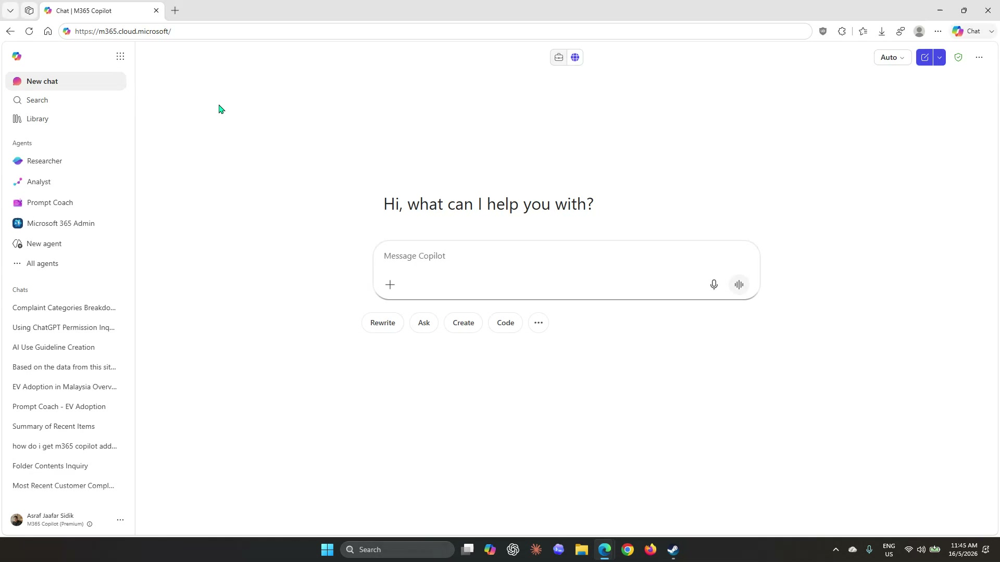
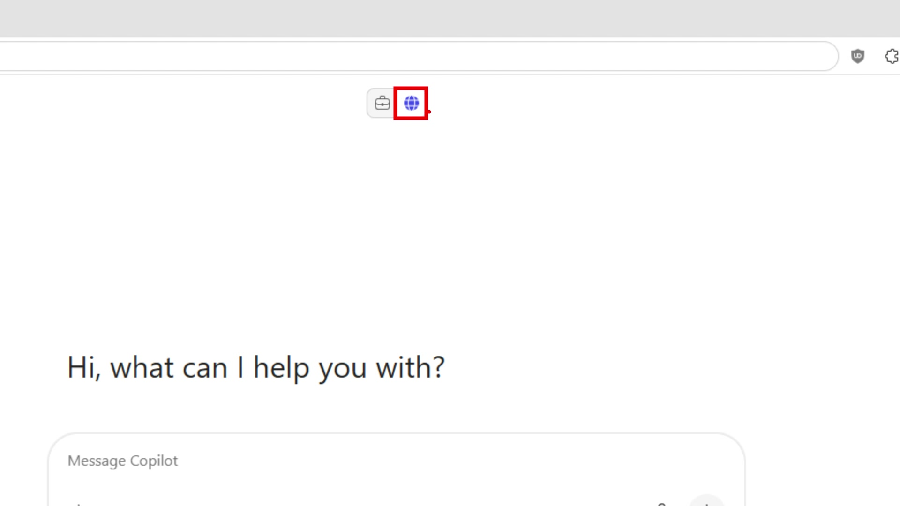
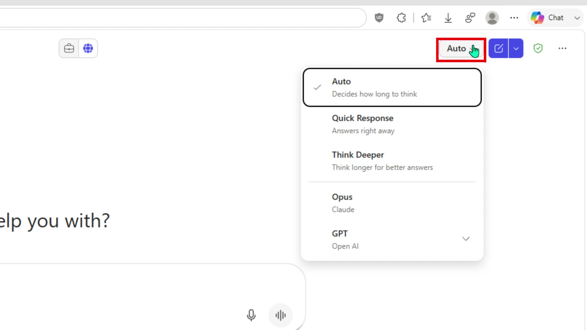
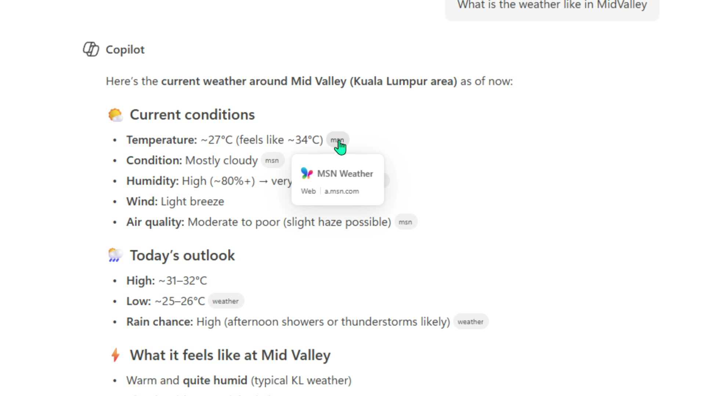
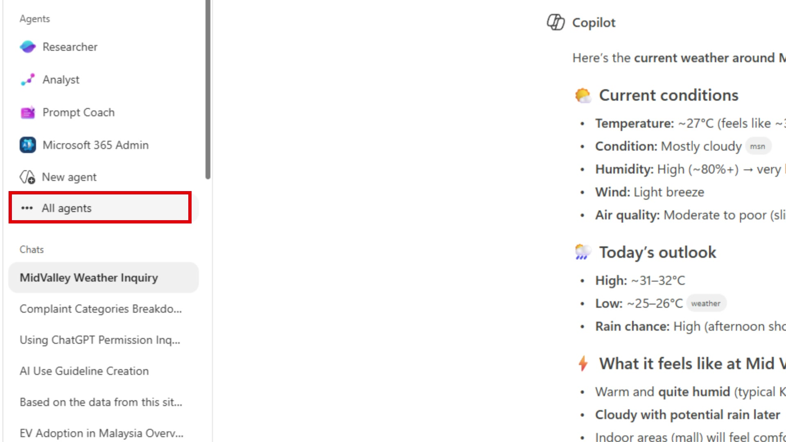
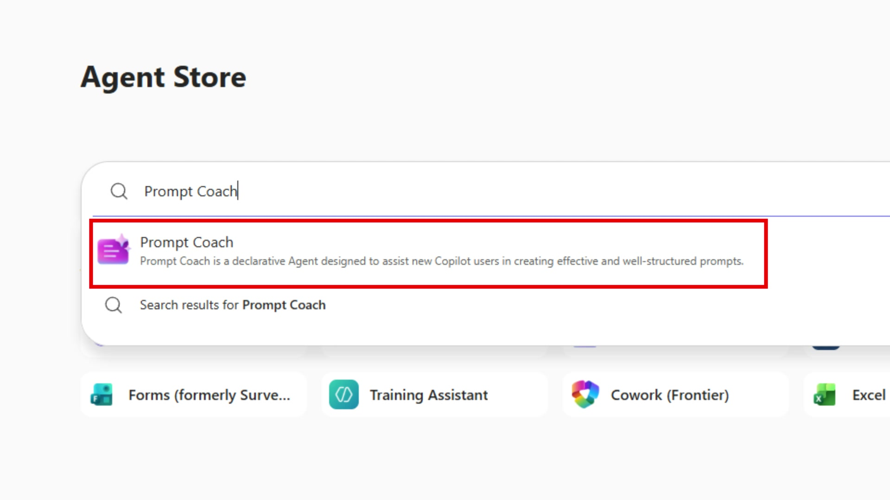
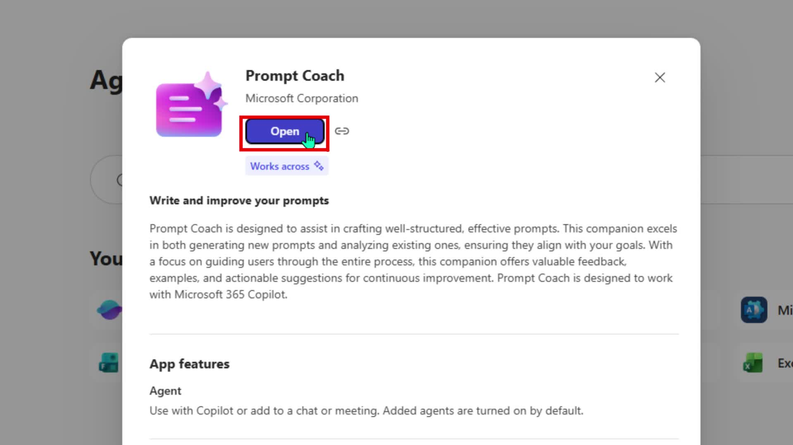
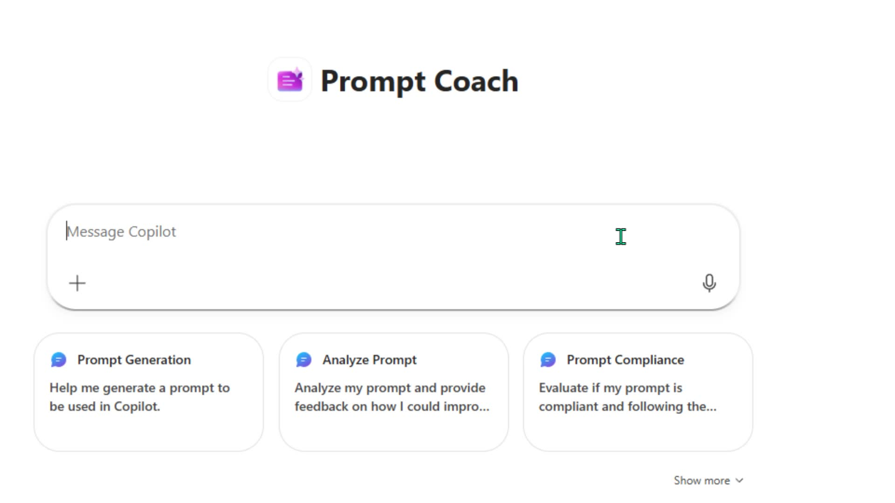

# Lab 01: Research with Copilot Chat

## Scenario

You are an **HR Officer at Mayfield Bank Berhad**. Your manager has asked you to research how other organisations and regulators approach workplace AI usage guidelines. You will use Copilot Chat with Web grounding to gather and synthesise findings before drafting the bank's own guideline.

In this lab, you learn how to:

- Open Copilot Chat and identify Web vs Work grounding.
- Write effective research prompts using the Context, Task, Source, Constraints, Output, Review pattern.
- Refine and follow up on responses.
- Distinguish source-based findings from Copilot's interpretive recommendations.

**This lab should take approximately 45 minutes.**

---

## Prompt construction method

These labs use a simple prompt pattern. You do not need to use every element every time, use what the task needs.

| Element | What to include |
| --- | --- |
| **Context** | Who you are and the business situation |
| **Task** | The exact action Copilot should perform |
| **Source** | Web, a file, a thread, or work data |
| **Constraints** | Tone, length, audience, exclusions |
| **Output** | The structure you want: table, bullets, email, summary |
| **Review** | Ask Copilot to flag assumptions, gaps, or items needing human review |

---

## Part A: Guided Exercise

### Task 1: Open Copilot Chat and orient yourself

1. Open a browser and go to [https://m365.cloud.microsoft](https://m365.cloud.microsoft), or open the **Microsoft 365 Copilot** app from Microsoft 365.

1. Sign in with your work or school account.

1. In the left sidebar, select **New chat** to start a clean session.

    

1. Near the top centre of the screen you will see two small icons side by side, a briefcase and a globe. The briefcase represents **Work** grounding (your organisation's internal data); the globe represents **Web** grounding (public internet sources). Select the **globe icon** to switch to Web.

    

    > ***Note:** If neither icon is visible, your licence or tenant settings may not support this feature. Check with your trainer before continuing. Features may differ depending on whether you have Copilot Chat only or the full Microsoft 365 Copilot add-on licence.*

1. In the top-right corner, you will see a model selector labelled **Auto**. Leave this as is for now, Auto lets Copilot decide how much processing time a question needs based on its complexity. You can explore the other options (Quick Response, Think Deeper) later.

    

1. Before running the main research prompt, try a quick question to confirm Web grounding is working and to see how citations appear. Click into the **Message Copilot** box and type:

    ```
    What is the weather like in Kuala Lumpur today?
    ```

    Press **Enter** and wait for the response.

1. Look at the response. You will see small source tags, such as `msn` or `weather`, sitting inline with the text. Hover your mouse over one of these tags to see the full source name and the web address it came from.

    

    > ***Note:** This is how every Web-grounded response works, Copilot draws from live web sources and cites them inline. Get into the habit of checking these before acting on the information, especially for research that will inform a policy or document.*

You are now familiar with the interface. In the next task you will use these same controls to run the actual research for Mayfield Bank.

---

### Task 2: Run a research prompt

1. Type the following prompt and press **Enter**:

    ```
    Using web sources, research how large organisations handle AI usage guidelines in the workplace. Focus on HR use cases, confidential data, employee privacy, human decision-making, and training requirements. Return a table with these columns: Practice, Why it matters, Risk addressed, Recommendation for a Malaysian HR team.
    ```

1. Review the response. Check whether Copilot has cited sources below the answer.

1. Ask Copilot to separate what is confirmed from sources versus what is interpretive:

    ```
    Review your previous response. Identify which recommendations are drawn from the sources cited and which are your own interpretive suggestions. Label each row in the table as Source-based or Interpretive.
    ```

    > ***Note:** This step builds critical thinking, participants should understand that Copilot's output is not all equally grounded in evidence.*

---

### Task 3: Narrow the research scope

1. Follow up with a more focused prompt:

    ```
    Research Malaysian policy considerations relevant to workplace AI use. Include PDPA, national AI guidance if available, employee data handling, and human oversight requirements. Separate legal requirements from good-practice recommendations.
    ```

1. Then ask:

    ```
    Based on all the research so far, summarise the 5 most important practices for a Malaysian bank's HR team to include in an internal AI Usage Guideline. Return as a numbered list with a one-sentence explanation for each.
    ```

1. Save this summary, you will use it in Lab 02.

---

### Task 4: Use Prompt Coach to improve a research prompt

Copilot Chat includes a built-in agent called **Prompt Coach** that analyses your prompts and suggests improvements. In this task you will use it to refine a prompt before running it, a habit worth building before any important research.

1. In the left sidebar, select **All agents** to open the Agent Store.

    

1. In the **Search agents** box at the top of the Agent Store, type `Prompt Coach`. Select **Prompt Coach** from the results that appear.

    

1. When the detail card appears, check whether the button says **Open** or **Add**. If it says **Add**, select it first to install Prompt Coach, then select **Open**.

    

1. Prompt Coach opens with three built-in starter actions: **Prompt Generation**, **Analyze Prompt**, and **Prompt Compliance**. You can use these as shortcuts, or simply type your own request directly into the message box.

    

1. Type the following into the message box and press **Ente