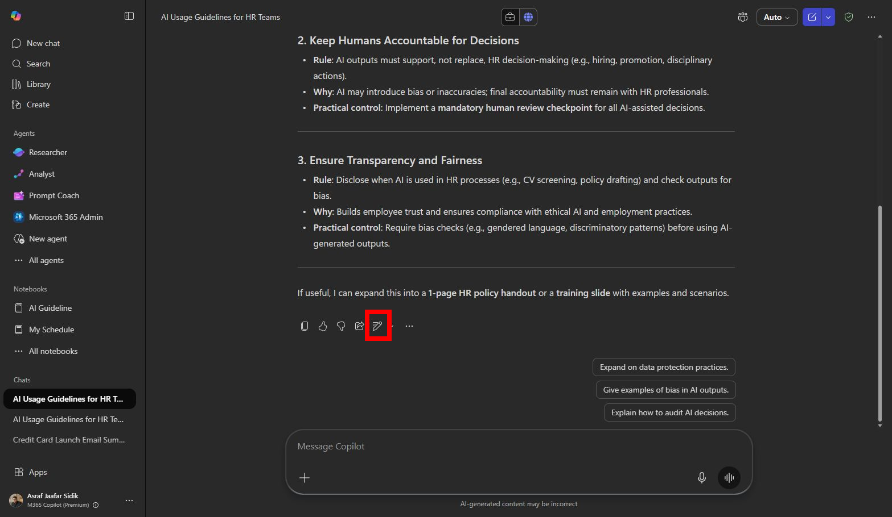
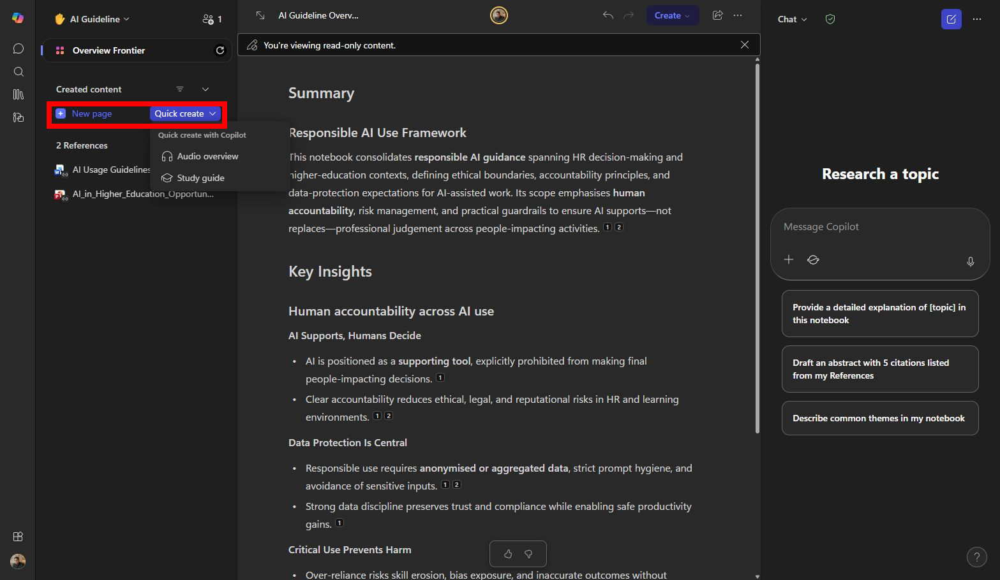
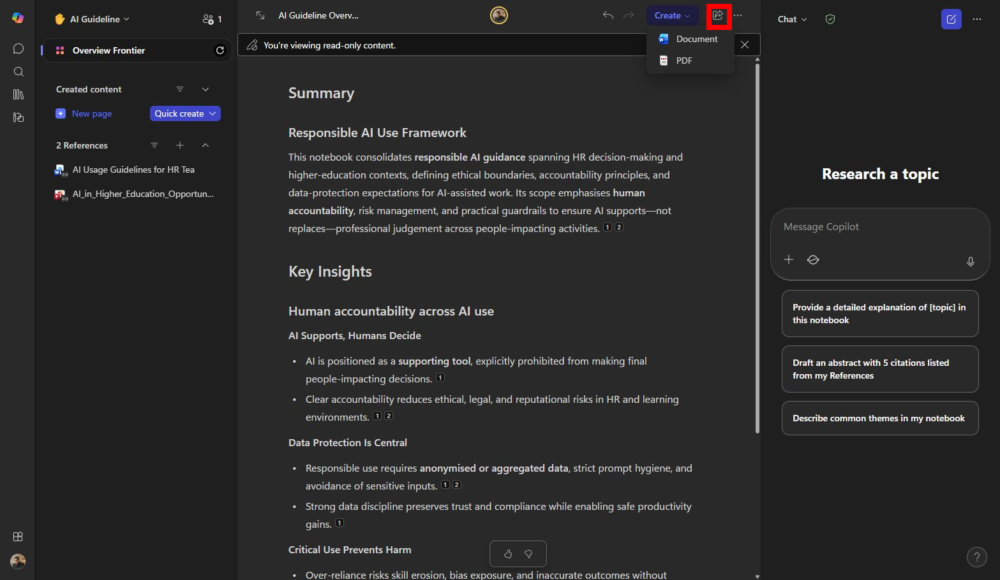

# Lab 02 — Organise research with Copilot Pages

## Scenario

You are still the **HR Officer at Mayfield Bank Berhad**. You have completed your research in Lab 01 and now need to organise the findings into a clean, shareable document that your team can review and build on before you start drafting the formal guideline. You will use Copilot Pages to compile, structure, and share the research.

In this lab, you learn how to:

- Send a Copilot Chat response to a Copilot Page.
- Add multiple research outputs to the same page.
- Edit and restructure content directly on the page.
- Add your own notes alongside Copilot-generated content.
- Share the page with a colleague for collaboration.

**This lab should take approximately 45 minutes.**

---

## Part A — Guided Exercise

### Task 1: Send research to a Copilot Page

1. Open **Copilot Chat** at [https://m365.cloud.microsoft/chat](https://m365.cloud.microsoft/chat). Make sure you are on **Web** grounding.

1. If your Lab 01 research is still visible in the chat thread, scroll to the response containing your 5-practice summary. If not, run this prompt again:

    ```
    Summarise the 5 most important AI usage guideline practices for a Malaysian bank's HR team. Return as a numbered list with a one-sentence explanation for each.
    ```

1. Below the response, look for the **Edit in Pages** icon (a pencil or page icon) or an **Add to Page** button. Select it to create a new Copilot Page from this response.

    

    > ***Note:** The exact label may vary depending on your tenant version. If you cannot find the button, look for a three-dot menu on the response or ask your trainer.*

---

### Task 2: Add more content to the same page

1. Back in Copilot Chat, run the following prompt:

    ```
    Research Malaysian policy considerations relevant to workplace AI use. Include PDPA, national AI guidance if available, employee data handling, and human oversight. Separate legal requirements from good-practice recommendations. Return as a table.
    ```

1. When the response appears, select **Add to Page** to append it to the same page you created in Task 1.

1. Run one more prompt and add it to the same page:

    ```
    List 3 examples of how Malaysian companies or banks have communicated AI usage rules to their staff. If specific examples are not available, describe what good communication looks like based on available guidance.
    ```

---

### Task 3: Organise and edit the page

1. Open the Copilot Page. It should now contain three sections of research content.

    

1. Add a title and header at the top:

    **AI Usage Guideline — Research Brief**
    *Prepared by: HR Department, Mayfield Bank Berhad*
    *Date: [Today's date]*

1. Rearrange the sections so they flow logically: Malaysian policy context first, then general best practices, then communication examples.

1. Under each section, add a short note in your own words summarising the key takeaway for Mayfield Bank. These are your own analyst notes, not Copilot-generated content.

1. Use the Copilot prompt box within the page to refine one section:

    ```
    Review this page for sections that are too vague for a Malaysian banking audience. Suggest targeted edits without rewriting the entire page.
    ```

---

### Task 4: Share the page

1. Select **Share** in the top-right corner of the page.

    

1. Enter your trainer's email address (or a colleague's, as directed).

1. Set the permission to **Can edit**.

1. Add a short message:

    ```
    Hi — please review this research brief and add any additional sources or policy points you think are relevant before we start drafting the guideline.
    ```

1. Select **Send**.

---

### Prompt practice

| Weak prompt | Better prompt | Why the better prompt works |
| --- | --- | --- |
| Add intro. | Add a short introduction to this page. Explain why Mayfield Bank HR needs an AI Usage Guideline, what risks it manages, and how employees should use the document. Keep it under 150 words. | Controls purpose, content, and length. |
| Make table. | Convert the selected Do and Do Not section into a 3-column table: Rule, Banking example, Why it matters. Keep each example relevant to a Malaysian bank. | Names the selected content, table structure, and scenario context. |
| Improve this. | Review this page as if you are an HR governance reviewer. Identify sections that are too vague, too strict, or missing practical banking examples. Suggest changes without rewriting the entire page. | Asks for targeted review instead of uncontrolled rewriting. |

---

### Extended practice

- Convert one long policy section into a table, one into bullets, and one into a short FAQ. Compare which format is easiest for beginners.
- Highlight a dense paragraph and ask Copilot to reduce it by 30 percent without changing the meaning.
- Ask Copilot to add a glossary of key AI terms suitable for non-technical HR staff.

---

## Part B — Independent Exercise

**Scenario:** You are a **Strategy and Planning Analyst at Mayfield Bank Berhad**. Your department head has asked you to compile a research brief on digital banking trends in Southeast Asia to inform the bank's 3-year digital transformation roadmap.

Using what you practised in Part A, complete the following with minimal guidance:

1. Use Copilot Chat (Web grounding) to research the top digital banking trends in Malaysia and Southeast Asia for 2025. Ask about which banks or fintechs are leading each trend.

1. Run a second prompt about how Malaysian banks are using AI in their operations — ask for 3 specific use cases.

1. Send both responses to a single Copilot Page.

1. Organise the page with a title, your own section headers, and a short analyst note under each section.

1. Share the page with your trainer with a brief message asking for their input before the strategy meeting next week.

---

## Lab complete

You have compiled research from multiple Copilot Chat sessions into a single organised, collaborative Copilot Page. In Lab 03 you will convert the research into a formal Word document and polish it for stakeholder review.
