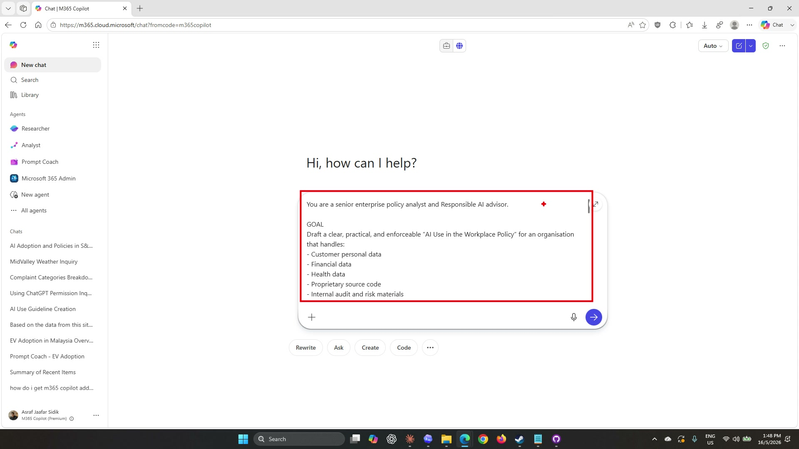
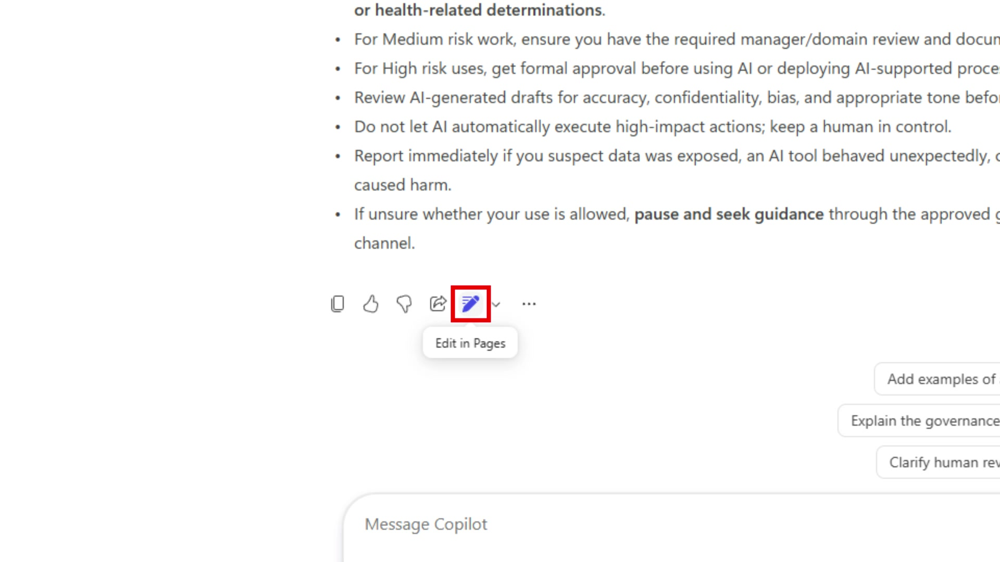
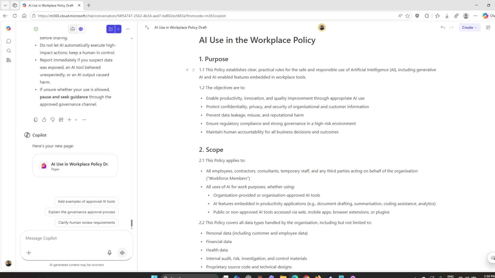
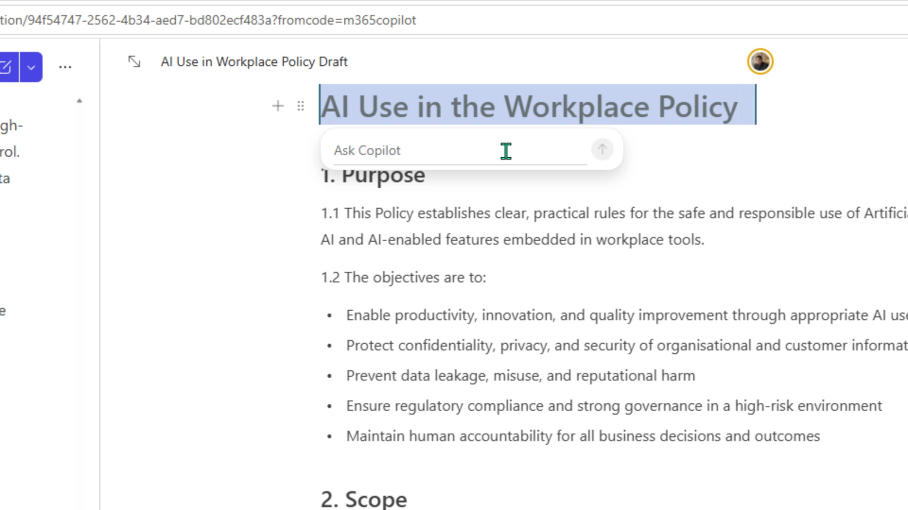
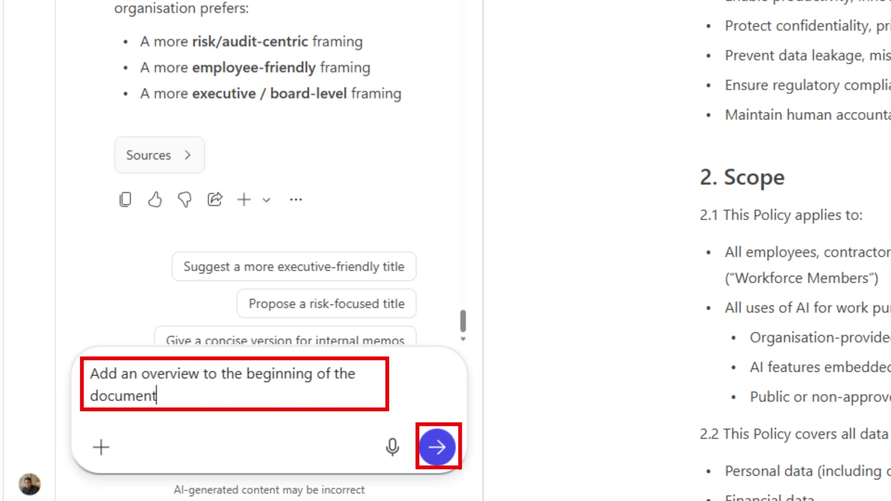
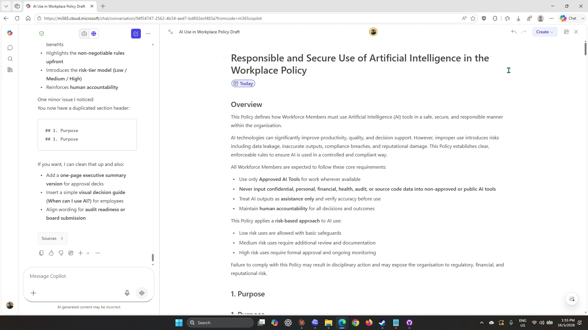
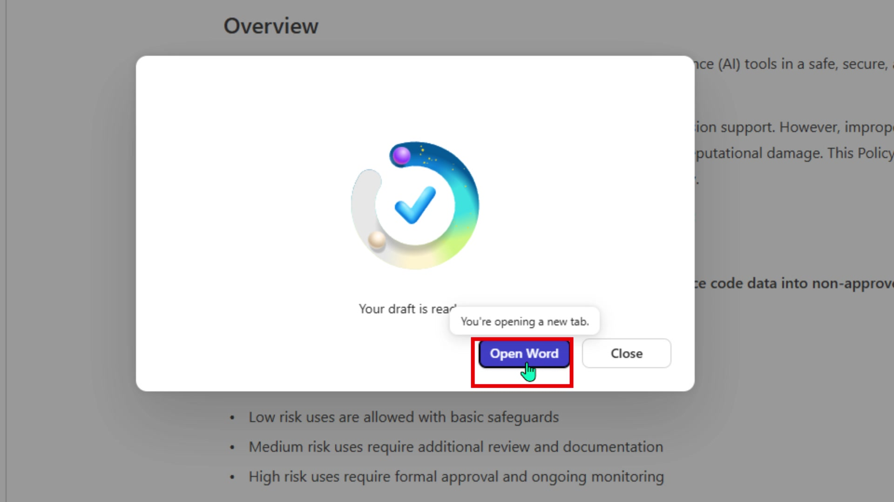

# Lab 02 — Draft and organise with Copilot Pages

## Scenario

You are still the **HR Officer at Mayfield Bank Berhad**. Your research from Lab 01 is complete, and you have a clear picture of what the AI Usage Guideline needs to cover. Now you will use a structured prompt to generate a full draft of the guideline in Copilot Chat, move it into **Copilot Pages** to refine and organise it, then prepare it for polishing in Word.

In this lab, you learn how to:

- Use a structured prompt to generate a complete policy draft in Copilot Chat.
- Open a Copilot Chat response directly in Copilot Pages.
- Edit and refine content using inline Copilot within Pages.
- Add sections and reorganise using the chat panel alongside Pages.
- Export the finished page to Word for final polishing.

**This lab should take approximately 45 minutes.**

---

## Part A — Guided Exercise

### Task 1: Generate the draft guideline in Copilot Chat

In Lab 01, you used Prompt Coach to generate a structured, improved prompt. In this task you will run that prompt — adapted for Mayfield Bank — to produce a complete first draft of the AI Usage Guideline.

1. Open Copilot Chat at [https://m365.cloud.microsoft/chat](https://m365.cloud.microsoft/chat) and start a **New chat**.

1. Confirm that **Web** grounding is selected (globe icon).

1. Click into the message box and type the following prompt, then press **Enter**:

    ```
    You are a senior enterprise policy analyst and Responsible AI advisor.

    GOAL
    Draft a clear, practical, and enforceable "AI Use in the Workplace Policy" for Mayfield Bank Berhad, a commercial bank in Malaysia that handles:
    - Customer personal data
    - Financial data
    - Health data
    - Proprietary source code
    - Internal audit and risk materials

    The policy must enable productivity and innovation while strongly protecting confidentiality, regulatory compliance, and organisational reputation.

    CONTEXT
    The bank operates in a high-risk regulated environment. Employees increasingly use generative AI and AI-enabled features embedded in workplace tools such as document drafting, summarisation, and analytics. The bank wants to:
    - Prevent data leakage and misuse of AI
    - Clearly define what employees can and cannot do
    - Comply with PDPA and Bank Negara Malaysia guidelines on technology risk
    - Prefer approved, enterprise-controlled AI tools over public AI

    FORMAT
    Produce a complete policy document with numbered sections covering: Purpose, Scope, Approved AI Tools, Data Classification and Restrictions, Permitted and Prohibited Uses, Human Oversight Requirements, Incident Reporting, Training Requirements, and Governance. Under each section include specific, actionable rules. Use formal but accessible language suitable for all staff levels.
    ```

    

1. Wait for Copilot to generate the full policy. The response will be long — scroll through it to see how Copilot has structured the document into numbered sections.

    > ***Note:** This is a significantly longer and more structured output than the research responses in Lab 01. The detailed prompt — which specifies a role, goal, context, and format — is what produces a draft that is immediately usable rather than a summary that still needs developing.*

---

### Task 2: Open the draft in Copilot Pages

1. Scroll to the bottom of Copilot's response. Below the last line of content, you will see a row of small action icons — copy, thumbs up, thumbs down, share, and a pencil-style icon.

1. Select the **pencil/page icon**. A tooltip reading **Edit in Pages** will appear below it.

    

    > ***Note:** If you cannot find the icon, look for a three-dot overflow menu on the response. The feature may be labelled "Open in Pages" or "Add to Page" depending on your tenant version.*

1. Copilot Pages will open in a split view alongside the chat panel. The left side shows the Copilot Chat panel, and the right side shows the Pages document with the policy content already loaded.

    

1. Spend a moment looking around the Pages interface. Note the page title at the top, the document body below, and the small **Ask Copilot** inline button that appears when you select text or hover near a heading.

---

### Task 3: Refine the document using inline Copilot

Pages lets you ask Copilot to edit specific parts of the document without leaving the page. In this task you will use two methods: inline editing directly on selected content, and the chat panel alongside the page.

#### Rename the title

1. Click on the title at the top of the document to select it.

1. An inline **Ask Copilot** box will appear. Type the following and press **Enter**:

    ```
    Rename this to: AI Use in Workplace Policy Draft
    ```

    

1. Copilot will update the title on the page. The change appears immediately in the document.

#### Add an overview section

1. In the **left chat panel**, type the following and press **Enter**:

    ```
    Add an overview to the beginning of the document
    ```

    

1. Copilot will generate a short executive overview and insert it at the start of the document. Watch the right panel — the content updates in real time as Copilot writes.

1. Review the completed page. The document now opens with an Overview section that summarises the policy's purpose, key requirements, and risk approach in plain language before the numbered sections begin.

    

    > ***Note:** Notice that Copilot also flagged a minor issue — a duplicate section heading. This is a good reminder that AI-generated content always needs a human review pass before it is finalised. Make a note of any issues you spot.*

---

### Task 4: Export the page to Word

When you are happy with the page, you can export it to a Word document for further formatting and stakeholder review. Lab 03 picks up from exactly this point.

1. In the top-right area of the Pages interface, select **Create** or look for the Word export option. The exact label may vary — look for an icon resembling a Word document or a button labelled **Open in Word**.

1. A confirmation dialog will appear showing a Copilot icon and the message **Your draft is ready**. Select **Open Word** to open the document in a new browser tab.

    

1. Confirm that the policy content has transferred correctly — check that sections, headings, and the Overview section are all present.

    > ***Note:** You do not need to make any changes in Word right now. Lab 03 covers editing and polishing the document. For now, simply confirm the export worked and then return to this lab.*

---

### Prompt practice

| Weak prompt | Better prompt | Why the better prompt works |
| --- | --- | --- |
| Write a policy. | You are a senior enterprise policy analyst. Draft a clear, practical, enforceable AI Use in the Workplace Policy for a Malaysian bank. Include numbered sections for: Purpose, Scope, Approved Tools, Data Restrictions, Permitted and Prohibited Uses, Human Oversight, Incident Reporting, Training, and Governance. Use formal but accessible language. | Assigns a role, names the organisation type, lists every required section, and specifies the audience and tone. Copilot cannot guess these from a short prompt. |
| Fix the title. | Rename this to: AI Use in Workplace Policy Draft | Tells Copilot exactly what the output should say rather than asking it to decide. |
| Make it better at the start. | Add an overview to the beginning of the document that summarises the policy's purpose, the key rules all staff must follow, and how the risk-tier model works. Keep it under 200 words. | Names the three things the overview needs to cover and caps the length so the overview does not grow into a second introduction. |

---

### Extended practice

- Ask Copilot to add a one-page executive summary version suitable for board submission.
- Select the Permitted and Prohibited Uses section and ask Copilot to convert it into a two-column table: Permitted, Prohibited. Ask it to add a banking-specific example in each row.
- Ask Copilot to review the page as an HR governance reviewer and flag any sections that are too vague for enforcement.

---

## Part B — Independent Exercise

**Scenario:** You are a **Relationship Manager at Mayfield Bank Berhad**. Before your meeting with the logistics company from Lab 01 Part B, you want to produce a clean, shareable one-page briefing in Copilot Pages that you can reference during the call and share with your team lead afterwards.

Using what you practised in Part A, complete the following with minimal guidance:

1. Open a new Copilot Chat session with Web grounding. Run a focused prompt asking Copilot to draft a one-page pre-meeting briefing for a Relationship Manager preparing to meet a mid-sized Malaysian logistics company. Include: current industry challenges, likely financing needs for a company with around RM 50 million in annual revenue, and 3 talking points referencing Mayfield Bank's SME financing solutions.

1. When the response appears, open it in Copilot Pages using the **Edit in Pages** button.

1. In Pages, use the inline Ask Copilot feature to update the document title to something appropriate for the meeting.

1. Use the chat panel alongside Pages to ask Copilot to add a short **Key questions to ask** section at the end of the document.

1. Review the final page and note one thing you would change manually that Copilot missed or got wrong.

> ***Note:** Part B uses the same skill sequence as Part A — structured prompt in Chat, open in Pages, inline Copilot, chat panel edits — but in a client-facing sales context. If you get stuck, refer back to the tasks above for the specific steps.*

---

## Lab complete

You have used a structured prompt to generate a complete draft policy, moved it into Copilot Pages, refined the content using inline Copilot and the chat panel, and exported it to Word. In Lab 03 you will open that Word document and use Copilot in Word to polish, reformat, and finalise the guideline for stakeholder review.
