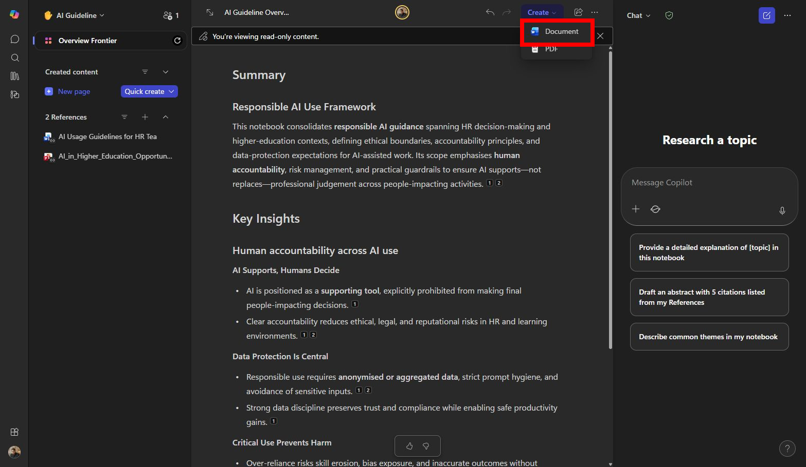
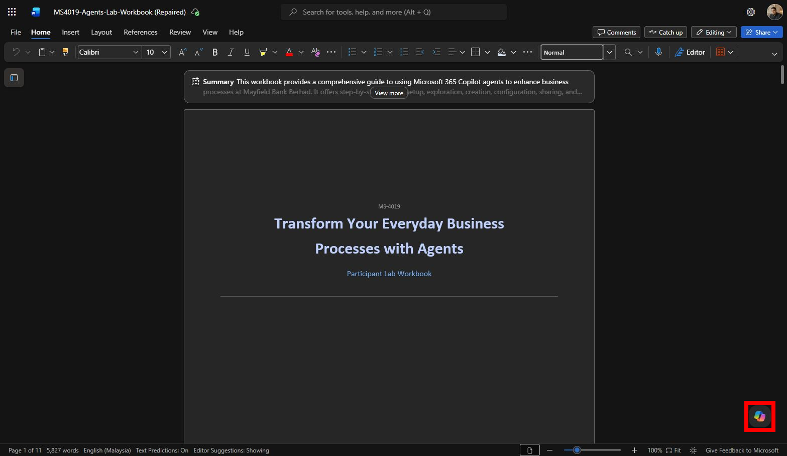

# Lab 03: Draft and polish the guideline

## Scenario

You are still the **HR Officer at Mayfield Bank Berhad**. Your research brief from Lab 02 has been reviewed and approved by your manager. Now you need to turn it into a formal **AI Usage Guideline** document, structured for both staff and executive audiences, using Copilot in Word.

In this lab, you learn how to:

- Convert a Copilot Page into a Word document.
- Use Copilot in Word to draft a structured guideline from research.
- Rewrite and improve specific sections.
- Add an executive summary.
- Review the document for gaps and unclear wording.

**This lab should take approximately 45 minutes.**

---

## Part A: Guided Exercise

### Task 1: Convert the Copilot Page to Word

1. Open the **AI Usage Guideline, Research Brief** page you created in Lab 02.

1. In the upper-right area of the page, select **Create**, then select **Document**.

    

1. Wait for Copilot to prepare the draft, then select **Open Word**.

1. Review the document structure. Check the title, headings, and section order.

    > ***Note:** The conversion preserves most formatting but may not be perfect. You will improve the structure using Copilot in the next task.*

---

### Task 2: Draft the guideline structure

1. In Word, open the **Copilot** panel from the Home ribbon or the Copilot button in the document margin.

    

1. Type the following prompt:

    ```
    Based on the content in this document, draft a complete internal AI Usage Guideline for Mayfield Bank Berhad's HR department. Use these sections: Purpose, Scope, Approved Uses, Restricted Uses, Sensitive Data Rules, Human Review Requirements, Practical Examples, Escalation Process, and Review Schedule. Write in clear corporate language suitable for non-technical HR staff.
    ```

1. Review the draft. If sections are missing or thin, ask Copilot to expand them:

    ```
    Expand the Sensitive Data Rules section. Include specific examples relevant to a Malaysian bank's HR function, such as employee medical records, salary information, and performance review data.
    ```

---

### Task 3: Rewrite for clarity

1. Highlight the **Restricted Uses** section.

1. In the Copilot panel, type:

    ```
    Rewrite this section so it is easier to understand for HR staff with limited AI experience. Replace technical or legal language with plain examples. Keep the same rules but make them feel practical rather than punitive.
    ```

1. Accept the rewrite, then run a quality review:

    ```
    Review this entire document for unclear wording, repeated points, and sections that need legal or compliance review before publishing. Return findings as a table with: Section, Issue, Severity, and Suggested action.
    ```

1. Address the highest-severity items manually or with a targeted follow-up prompt.

---

### Task 4: Add an executive summary

1. Place your cursor at the very top of the document, above the first heading.

1. In the Copilot panel, type:

    ```
    Add a one-page executive summary at the beginning of this document. Include: purpose of the guideline, key risks it addresses, the 3 most important rules for staff, rollout plan, and approval needed from leadership. Keep it under 200 words.
    ```

1. Review the summary. Adjust tone and wording manually if needed.

---

### Prompt practice

| Weak prompt | Better prompt | Why the better prompt works |
| --- | --- | --- |
| Summarize this. | Summarise this AI Usage Guideline in 8 bullets. Focus on what HR employees must do, must not do, and must escalate. | Tells Copilot what to prioritise in the summary. |
| Make it executive. | Restructure this document for executive approval. Use these sections: Executive Summary, Purpose, Scope, Key Rules, Sensitive Data Handling, Human-Impacted Decisions, Implementation Plan, and Approval Needed. | Gives the exact target structure and purpose. |
| Check grammar. | Review this document for unclear wording, inconsistent terms, repeated points, and sections that need examples. Return a table of proposed changes before rewriting anything. | Introduces a review-first workflow, reducing unwanted changes. |
| Make shorter version. | Create a one-page quick reference version of this guideline for staff. Use four sections: Approved use, Do not use, Always escalate, and Always verify. | Defines the target format and audience clearly. |

---

### Extended practice

- Ask Copilot to produce three summaries: an executive summary, a manager summary, and a staff quick guide. Compare tone and level of detail.
- Ask Copilot to create a table of proposed edits before rewriting the document, then apply only the highest-priority changes.
- Ask Copilot to identify repeated points across sections and suggest a tighter structure with fewer overlaps.

---

## Part B: Independent Exercise

**Scenario:** You are a **Credit Analyst in the Corporate Banking division at Mayfield Bank Berhad**. Your team has just completed a site visit to a manufacturing client in Johor Bahru who is applying for a RM 8 million term loan. You have rough notes from the visit.

Using what you practised in Part A, complete the following with minimal guidance:

1. Open a new blank Word document and use Copilot to draft a **Credit Assessment Summary** from these notes:
    - Client: Teguh Jaya Manufacturing Sdn Bhd, Johor Bahru
    - Industry: Metal fabrication, supplying to oil and gas sector
    - Loan amount: RM 8 million term loan, 7-year tenure
    - Purpose: Purchase of CNC machinery to expand capacity
    - Revenue FY2023: RM 22 million, FY2024 projected: RM 28 million
    - EBITDA margin: approximately 14%
    - Existing facilities: RM 3 million overdraft with Mayfield Bank, clean track record
    - Key risk: Customer concentration, top 3 customers account for 68% of revenue
    - Collateral: Factory land and building in Pasir Gudang, valued at RM 6.5 million
    - Sections required: Client Background, Financial Overview, Loan Details, Risk Assessment, Recommendation

1. Rewrite the Risk Assessment section to be more analytical. Include how the customer concentration risk could be mitigated.

1. Add a one-paragraph Executive Summary (under 80 words) at the top.

---

## Lab complete

You have drafted and polished a formal Word document using Copilot, starting from a Copilot Page and ending with an executive-ready guideline. In Lab 04 you will use Copilot in Outlook to request stakeholder approval.
