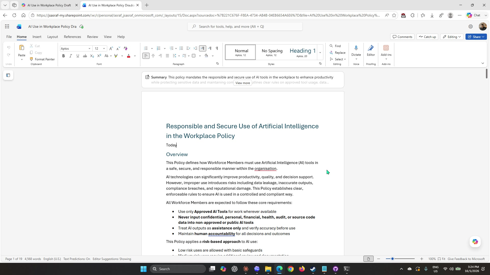
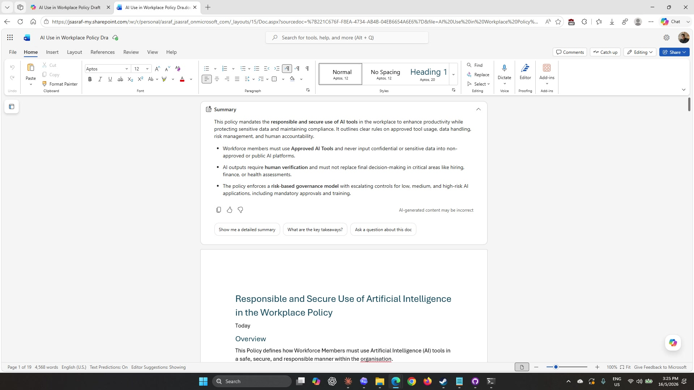
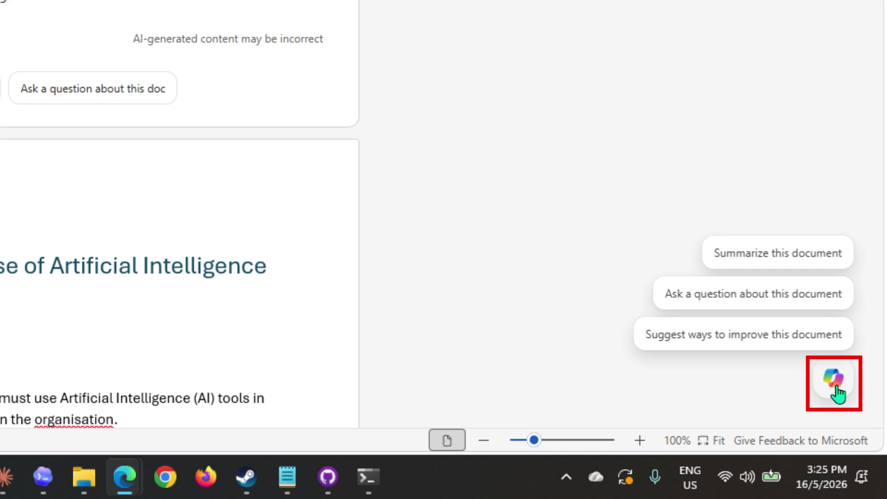
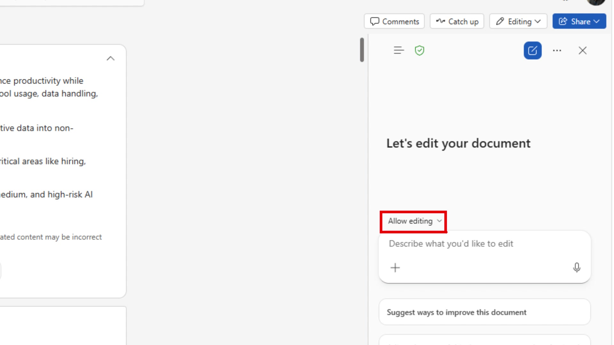
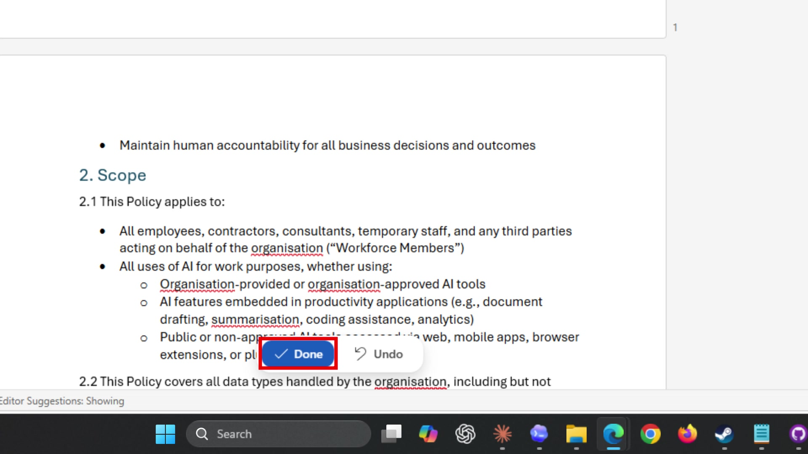
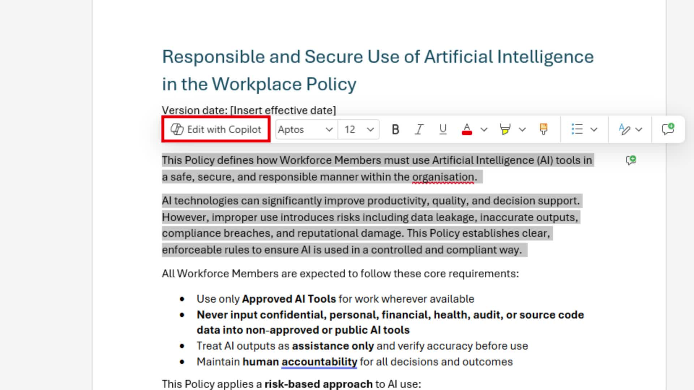
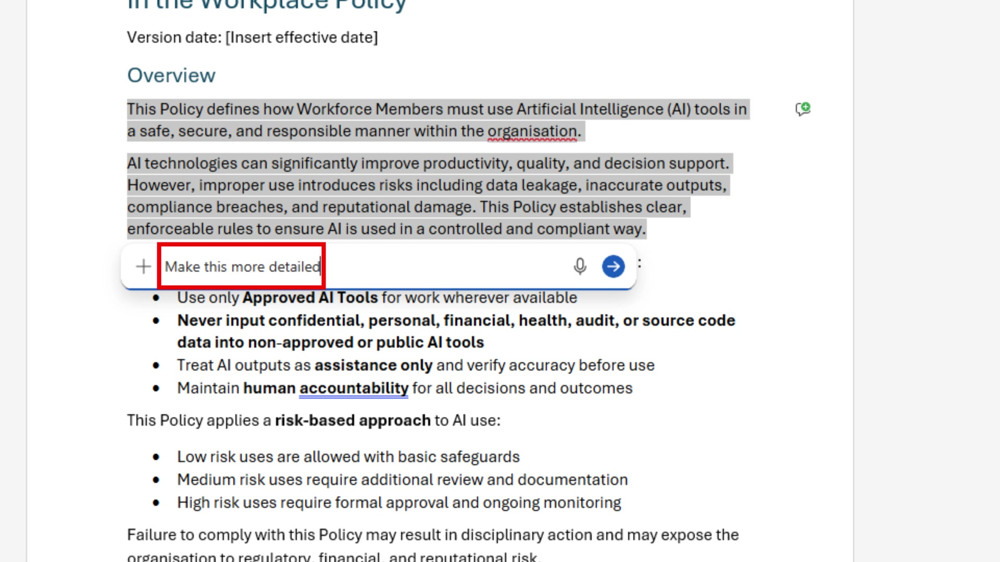

# Lab 03: Polish the guideline in Word

## Scenario

You are still the **HR Officer at Mayfield Bank Berhad**. Your draft AI Usage Guideline is now in Word, exported from Copilot Pages at the end of Lab 02. The document is structurally sound but needs polishing before it can go to your manager for approval. You will use Copilot in Word to review the overall structure, tighten specific sections, and add an executive summary for leadership.

In this lab, you learn how to:

- Review an AI-generated document summary in Word.
- Use the Copilot panel to make document-wide improvements.
- Use **Edit with Copilot** to rewrite a specific section without touching the rest.
- Accept or reject Copilot's changes using the Done and Undo controls.
- Add an executive summary suitable for management review.

**This lab should take approximately 45 minutes.**

---

## Part A: Guided Exercise

### Task 1: Open the document and review the summary

At the end of Lab 02, you selected **Open Word**, which opened the policy draft in Microsoft Word for the web. If you closed the tab, reopen the document from your OneDrive.

1. You should now see **Microsoft Word** open in your browser with the AI Usage Guideline loaded. The document title, headings, and Overview section should all be present from the Pages export.

    

1. At the top of the document, just below the ribbon, you will see a **Summary** banner. This is Copilot's automatic summary of the open document — it reads the full file and gives you a condensed version without you having to ask. Select **View more** to expand it.

    

1. Read through the summary. Check whether Copilot has captured the key points accurately. Note any important rules or sections that are missing from the summary — if the summary missed something, the section may need to be strengthened in the document itself.

1. Use the follow-up buttons at the bottom of the summary panel to ask Copilot a question about the document:

    ```
    What are the key takeaways?
    ```

    > ***Note:** The Summary panel is read-only and does not modify the document. It is a quick way to verify whether the document communicates its key points clearly before you start editing.*

---

### Task 2: Use the Copilot panel to improve the document

1. Hover your mouse over the **Copilot icon** at the bottom-right corner of the screen. Three prompt suggestions will appear above it.

    

1. Select the Copilot icon to open the **Copilot panel** on the right side. The panel opens with a prompt field labelled **Describe what you'd like to edit** and an **Allow editing** dropdown above it.

    

1. The **Allow editing** dropdown controls what scope Copilot can change. Leave it set to **Allow editing** so Copilot can modify the full document.

1. Type the following prompt into the panel and press the send button:

    ```
    Review this document for duplicate section headers and inconsistent numbering. Remove any repeated headings and ensure all numbered sections follow a consistent format throughout.
    ```

1. Wait for Copilot to process the request. A loading indicator will appear briefly in the panel, then the document will update on the left.

1. Review the changes Copilot made. At the bottom of the document you will see a **Done** and **Undo** bar. If the changes look correct, select **Done** to accept them. If something looks wrong, select **Undo** to revert.

    

    > ***Note:** Always read through Copilot's changes before accepting them. Done is permanent — Undo is your safety net if the edit missed the mark.*

---

### Task 3: Rewrite a section using Edit with Copilot

The Copilot panel edits the whole document at once. For targeted rewrites on a single section, Word offers a more precise tool: **Edit with Copilot**, which only touches the text you have selected.

1. Scroll to the **Permitted and Prohibited Uses** section of the document. Click and drag to highlight the full section, including the heading.

    

1. A small floating toolbar will appear above your selection. Select **Edit with Copilot** from the toolbar.

1. An inline prompt box will appear just below the selection. Type the following and press **Enter**:

    ```
    Make this more detailed
    ```

    

1. Copilot will expand the selected text in place. Only the highlighted section changes — the rest of the document stays untouched.

1. Review the expanded section. If it is accurate and relevant to a Malaysian banking context, select **Done** to accept. If it added incorrect examples or drifted from the bank scenario, select **Undo** and try a more specific prompt:

    ```
    Make this more detailed. Add specific examples relevant to an HR team at a Malaysian bank, such as using Copilot for drafting offer letters, summarising performance reviews, and generating training materials.
    ```

---

### Task 4: Add an executive summary

The document is now well-structured and detailed. Before sending it for approval, you need a short executive summary at the top for your manager and leadership team.

1. Place your cursor at the very beginning of the document, before the first heading.

1. Open the **Copilot panel** again using the button at the bottom right. Type the following:

    ```
    Add a one-page executive summary at the beginning of this document. Include: the purpose of the guideline, the key risks it addresses, the 3 most important rules for all staff, and the approval required from leadership. Keep it under 200 words and use clear language suitable for a non-technical audience.
    ```

1. Accept the summary using **Done** once it looks correct.

1. Run a final review prompt:

    ```
    Review this entire document for unclear wording, repeated points, and any sections that should be reviewed by Legal or Compliance before publishing. Return findings as a short table with: Section, Issue, and Recommended action.
    ```

1. Use the table of findings to decide what to address now and what to flag for Legal review. Make any final manual edits needed.

---

### Prompt practice

| Weak prompt | Better prompt | Why the better prompt works |
| --- | --- | --- |
| Summarize this. | Summarise this AI Usage Guideline in 8 bullets. Focus on what HR employees must do, must not do, and must escalate. | Tells Copilot what angle to take and how long the output should be. |
| Make it shorter. | Create a one-page quick reference version of this guideline for staff. Use four sections: Approved uses, Prohibited uses, Always escalate, and Always verify. | Defines the format, audience, and four specific sections instead of leaving the structure open. |
| Fix this section. | Rewrite the Permitted and Prohibited Uses section. Add specific examples relevant to HR staff at a Malaysian bank. Keep the same rules but make the language practical and easy to follow for non-technical readers. | Scopes the edit to one section, specifies what to add, and describes the target audience and tone. |
| Add summary. | Add a one-page executive summary at the beginning of this document. Include: purpose, key risks, the 3 most important rules, and approval required. Keep it under 200 words and write for a non-technical leadership audience. | Names every element the summary should cover and caps the length. |

---

### Extended practice

- Ask Copilot to produce three versions of the same section: one for executives, one for managers, and one for general staff. Compare how Copilot adjusts tone and depth for each audience.
- Highlight a dense paragraph and ask Copilot to reduce it by 30 percent without changing the meaning. Then check whether anything important was lost.
- Ask Copilot to identify repeated points across sections and suggest a tighter structure before rewriting anything.

---

## Part B: Independent Exercise

**Scenario:** You are a **Credit Analyst in the Corporate Banking division at Mayfield Bank Berhad**. Your team has just completed a site visit to a manufacturing client in Johor Bahru who is applying for a RM 8 million term loan. You have rough notes from the visit.

Using what you practised in Part A, complete the following with minimal guidance:

1. Open a new blank Word document. Use the Copilot panel to draft a **Credit Assessment Summary** from the following notes:

    - Client: Teguh Jaya Manufacturing Sdn Bhd, Johor Bahru
    - Industry: Metal fabrication, supplying to the oil and gas sector
    - Loan amount: RM 8 million term loan, 7-year tenure
    - Purpose: Purchase of CNC machinery to expand production capacity
    - Revenue FY2023: RM 22 million, FY2024 projected: RM 28 million
    - EBITDA margin: approximately 14%
    - Existing facilities: RM 3 million overdraft with Mayfield Bank, clean track record
    - Key risk: Customer concentration — top 3 customers account for 68% of revenue
    - Collateral: Factory land and building in Pasir Gudang, valued at RM 6.5 million
    - Sections required: Client Background, Financial Overview, Loan Details, Risk Assessment, Recommendation

1. Use **Edit with Copilot** on the Risk Assessment section to make it more analytical. Ask Copilot to include how the customer concentration risk could be mitigated.

1. Add a one-paragraph executive summary (under 80 words) at the top using the Copilot panel.

> ***Note:** Part B uses the same skill sequence as Part A — Copilot panel for document-wide changes, Edit with Copilot for targeted section edits, Done to accept. If you get stuck, refer back to the task steps above.*

---

## Lab complete

You have reviewed, restructured, and polished a Word document using Copilot, ending with an executive-ready AI Usage Guideline for Mayfield Bank. In Lab 04 you will use Copilot in Outlook to send the document for stakeholder approval.
