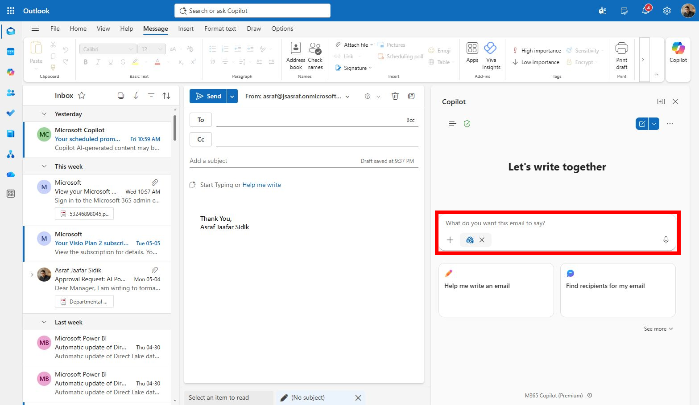

# Lab 04 — Request approval with Outlook

## Scenario

You are still the **HR Officer at Mayfield Bank Berhad**. The AI Usage Guideline is ready for stakeholder review. You need to send an approval request to HR leadership, then manage the replies that come back — summarising the thread and drafting a follow-up response to a concern raised.

In this lab, you learn how to:

- Draft a professional approval email using Copilot.
- Use Coaching by Copilot to improve tone and clarity.
- Summarise a stakeholder reply thread.
- Draft a focused reply to a specific concern.

**This lab should take approximately 45 minutes.**

---

## Part A — Guided Exercise

### Task 1: Draft the approval email

1. Open **Outlook** (desktop app or web at [https://outlook.office.com](https://outlook.office.com)).

1. Select **New Email**.

1. In the compose window, select the **Copilot** icon or **Draft with Copilot**.

    

1. Type the following prompt:

    ```
    Draft a professional email to HR leadership at Mayfield Bank Berhad requesting approval for the attached AI Usage Guideline. Include a 3-bullet summary of the guideline, why approval is needed now, the deadline for response, and a clear approval action. Keep the tone professional and direct.
    ```

1. Review the draft. Do not send it yet.

    > ***Note:** Approval emails need precision. Make sure the decision required and deadline are visible early in the email — not buried at the end.*

---

### Task 2: Improve with Coaching

1. In the compose window, select **Coaching by Copilot**.

1. Copilot will analyse your draft and suggest improvements to tone, clarity, and conciseness.

1. Review each suggestion. Accept the ones that improve the email and ignore the rest.

1. Make sure the email clearly states:
    - What is being approved
    - Why it matters
    - The deadline
    - What action stakeholders need to take

---

### Task 3: Summarise a reply thread

1. Open the email thread **RE: AI Usage Guideline — Approval Request** in your training mailbox (your trainer will have set this up).

1. At the top of the thread, select **Summary by Copilot**.

1. Read the summary. Then ask Copilot to break it down further:

    ```
    Summarise this approval thread. Separate confirmed decisions, objections, requested edits, owners, and follow-up actions. Include names only if they are already visible in the thread.
    ```

1. Identify the key concern raised by one stakeholder — a question about whether the guideline covers sensitive employee data adequately.

---

### Task 4: Draft a reply to the concern

1. Select **Reply** on the stakeholder's message.

1. In the compose window, select **Draft with Copilot** and type:

    ```
    Draft a concise reply acknowledging the stakeholder's concern about sensitive employee data coverage in the AI Usage Guideline. Confirm that the guideline will be updated with stronger examples covering medical records, salary data, and performance reviews. State that the revised version will be shared by Friday. Keep the tone professional and collaborative.
    ```

1. Review and refine the draft before finalising.

---

### Prompt practice

| Weak prompt | Better prompt | Why the better prompt works |
| --- | --- | --- |
| Write email to boss. | Draft a professional email to HR leadership requesting approval for the attached AI Usage Guideline. Include a 3-bullet summary, why approval is needed, deadline for response, and a clear approval action. | States recipient, purpose, summary structure, timeline, and call to action. |
| Summarize thread. | Summarise this approval thread. Separate confirmed decisions, objections, requested edits, and follow-up actions. Include names only if already visible. | Gives useful categories for project tracking. |
| Reply to stakeholder. | Draft a concise reply thanking the stakeholder for feedback. Acknowledge the privacy concern, state that the guideline will be updated with stronger sensitive data examples, and confirm the revised version will be shared by Friday. | Includes the concern, response intent, and next step. |
| Make shorter. | Rewrite this approval email so the decision request is visible in the first three lines. Keep the total email under 150 words. | Makes the call to action immediately visible for busy readers. |

---

### Extended practice

- Draft the same approval email in three tones: formal executive, collaborative manager, and concise project update. Compare which best fits the stakeholder.
- Ask Copilot to shorten a long approval request into a message under 150 words without losing the decision required.
- Ask Copilot to propose a follow-up if no reply has been received after 3 working days.

---

## Part B — Independent Exercise

**Scenario:** You are a **Retail Banking Officer at Mayfield Bank Berhad's Bangsar branch**. You have two email tasks this morning.

Using what you practised in Part A, complete the following with minimal guidance:

1. Open the email thread from **Puan Roslinda binti Ahmad** about a delayed fixed deposit renewal (your trainer will point you to this thread). Use **Summary by Copilot** to get up to speed, then draft an empathetic professional reply. Acknowledge the delay, assure her the matter is being prioritised, and let her know a Relationship Manager will contact her within one business day.

1. Draft a new outreach email to a new SME client — the owner of a halal food manufacturing company in Selangor. Introduce Mayfield Bank's SME Business Financing package. Highlight flexible repayment terms and the bank's dedicated SME Relationship Manager service. Keep it warm, professional, and under 150 words. Include a call to action to schedule a consultation.

---

## Lab complete

You have used Copilot in Outlook to draft approval communications, improve them with coaching, summarise a reply thread, and handle a stakeholder concern. In Lab 05 you will use Copilot in Teams to manage the follow-up meeting.
