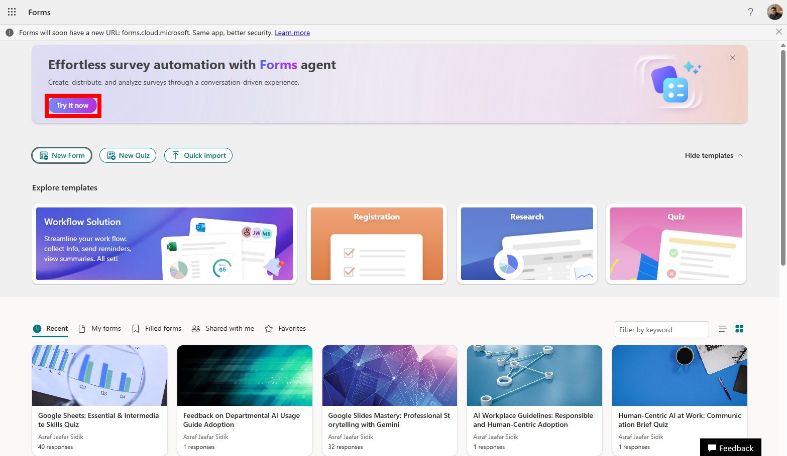

# Lab 06: Collect feedback with Forms

## Scenario

You are still the **HR Officer at Mayfield Bank Berhad**. The AI Usage Guideline has been approved and a staff briefing has been delivered. You now need to collect employee feedback to understand how well the guideline was received, where confusion remains, and what additional support staff need before full rollout.

In this lab, you learn how to:

- Use Copilot in Forms to generate a feedback survey.
- Review questions for bias, duplication, and clarity.
- Add a mix of question types.
- Prepare the form for distribution.

**This lab should take approximately 30 minutes.**

---

## Part A: Guided Exercise

### Task 1: Create the feedback form

1. Open **Microsoft Forms** at [https://forms.office.com](https://forms.office.com).

1. Select **New Form**.

    

1. If Copilot appears in the interface, select it and describe what you need. If not, use the manual approach with Copilot Chat to generate questions first (see Task 2).

1. Give the form a title:

    ```
    Mayfield Bank, AI Usage Guideline: Staff Feedback
    ```

---

### Task 2: Generate questions with Copilot

1. If Copilot is available directly in Forms, type:

    

    ```
    Create an employee feedback form for an AI Usage Guideline briefing at a Malaysian bank. Include questions on clarity of the guideline, confidence in applying the rules, concern areas, examples that need more explanation, and support needed. Use no more than 10 questions. Include a mix of rating scale, multiple choice, and open text questions.
    ```

1. If Copilot is not available in Forms for your tenant, open **Copilot Chat**, run the same prompt there, and manually create the questions in Forms based on the output.

    > ***Note:** Some tenants may not have Copilot directly in Forms. The workaround of generating questions in Copilot Chat first is equally valid and produces the same outcome.*

---

### Task 3: Review the questions

1. Read through each question and check for:
    - **Bias or leading language**, does the question push towards a particular answer?
    - **Duplication**, are two questions asking essentially the same thing?
    - **Clarity**, would a non-technical staff member understand this immediately?

1. Use Copilot Chat to run a quality review:

    ```
    Review these survey questions for bias, leading language, duplication, and unclear wording. Return a table with: Original question, Issue, Revised question.
    ```

    Paste your questions into the prompt.

1. Apply the suggested revisions to the form.

---

### Task 4: Add question types and preview

1. Make sure the form includes at least:
    - One **rating scale** question (e.g. How clear was the guideline?)
    - One **multiple choice** question (e.g. Which section needs more examples?)
    - One **open text** question (e.g. What support do you need before the guideline goes live?)

1. Select **Preview** to review the form as a participant would see it.

1. Check that the flow makes sense and no questions feel abrupt or out of order.

---

### Prompt practice

| Weak prompt | Better prompt | Why the better prompt works |
| --- | --- | --- |
| Make feedback form. | Create an employee feedback form for an AI Usage Guideline briefing. Include questions on clarity, confidence, concern areas, examples needing more explanation, and support needed. Use no more than 10 questions. | Defines objective and keeps the form short and focused. |
| Ask about policy. | Generate survey questions to evaluate whether HR employees understand these rules: do not enter sensitive employee data into unauthorised AI tools, keep humans accountable for hiring decisions, and verify AI-generated content before use. | Ties questions directly to specific learning objectives from the guideline. |
| Make it better. | Review this form for biased, leading, duplicated, or unclear questions. Return a table with: original question, issue, and revised question. | Turns Copilot into a quality reviewer before the form is distributed. |

---

### Extended practice

- Create one version of the form for general staff and another for managers. Compare which questions should differ between the two audiences.
- Ask Copilot to rewrite weak questions so they are neutral, shorter, and easier to answer.
- Ask Copilot to identify the single most important open-text question that would give the training team the most useful insight.

---

## Part B: Independent Exercise

**Scenario:** You are the **Training Coordinator at Mayfield Bank Berhad**. Following a bank-wide AI awareness session for branch staff, you need to measure how confident they feel about using AI tools responsibly in their daily work.

Using what you practised in Part A, complete the following with minimal guidance:

1. Create a new form titled **Branch Staff AI Confidence Survey**.

1. Use Copilot (in Forms or via Copilot Chat) to generate no more than 8 questions covering: confidence level, specific tasks staff are unsure about, concern about customer data, and what kind of follow-up support they prefer.

1. Review the questions for bias and clarity before finalising.

1. Preview the form and confirm it is ready to distribute.

---

## Lab complete

You have designed a structured employee feedback form using Copilot, reviewed it for quality, and prepared it for distribution. In Lab 07 you will analyse the responses in Excel.
