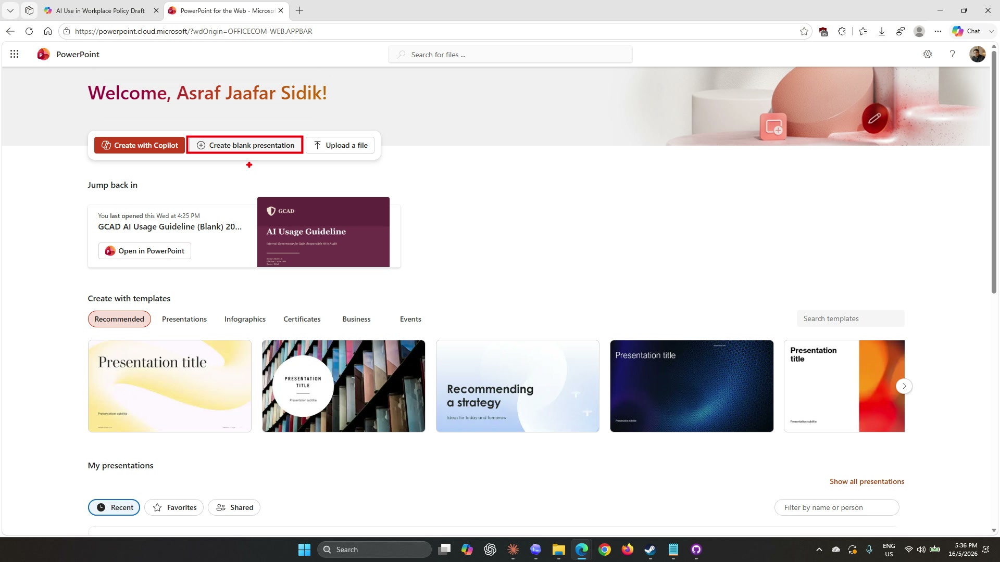
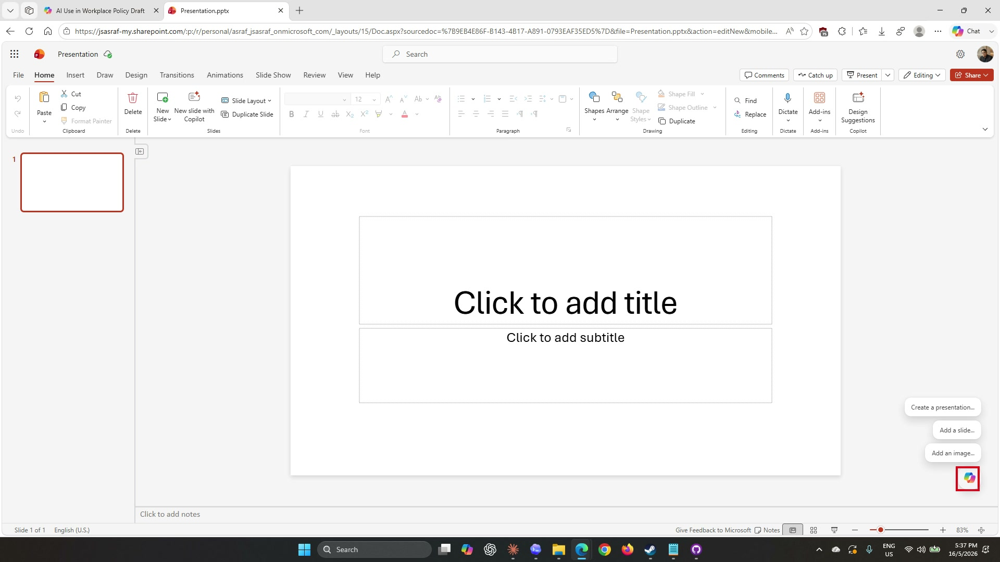
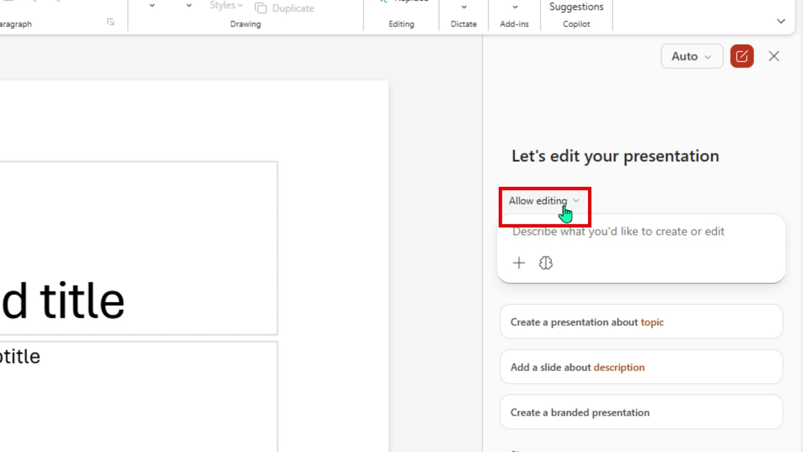
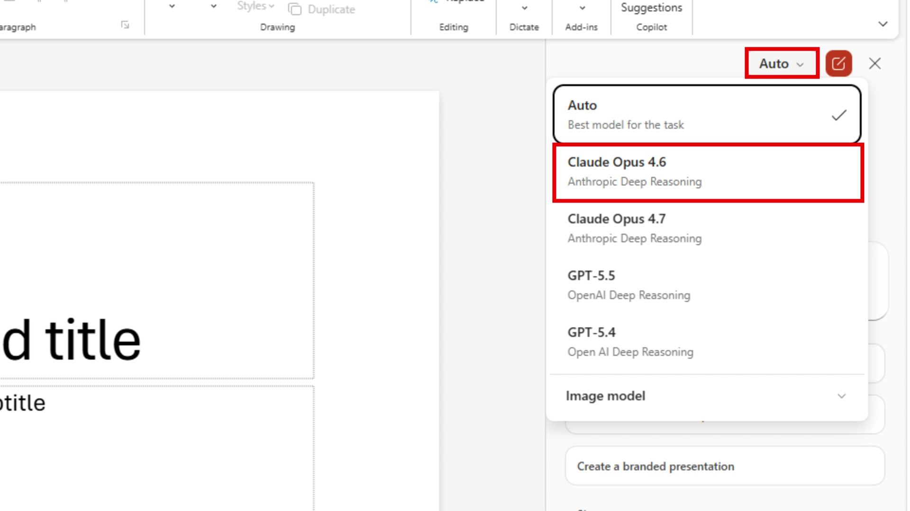
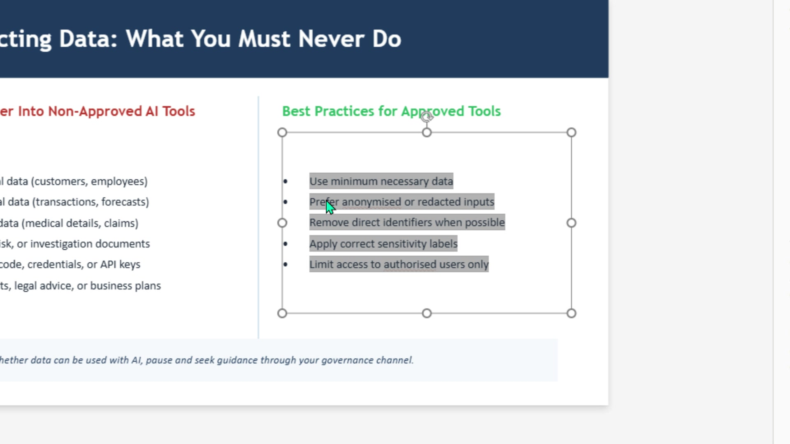
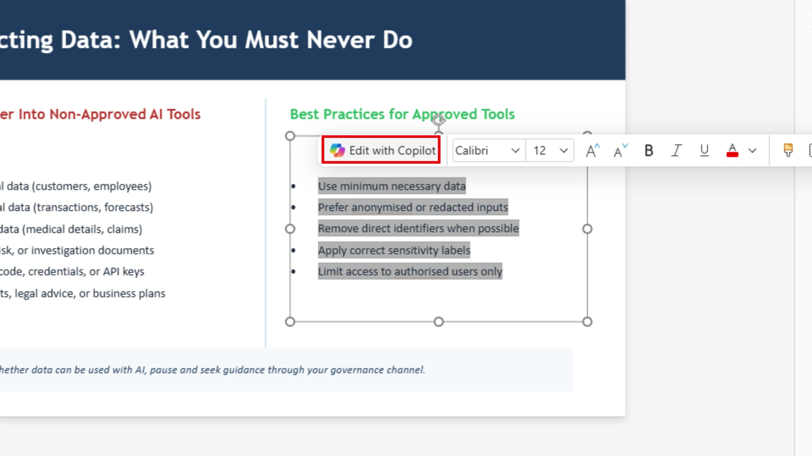
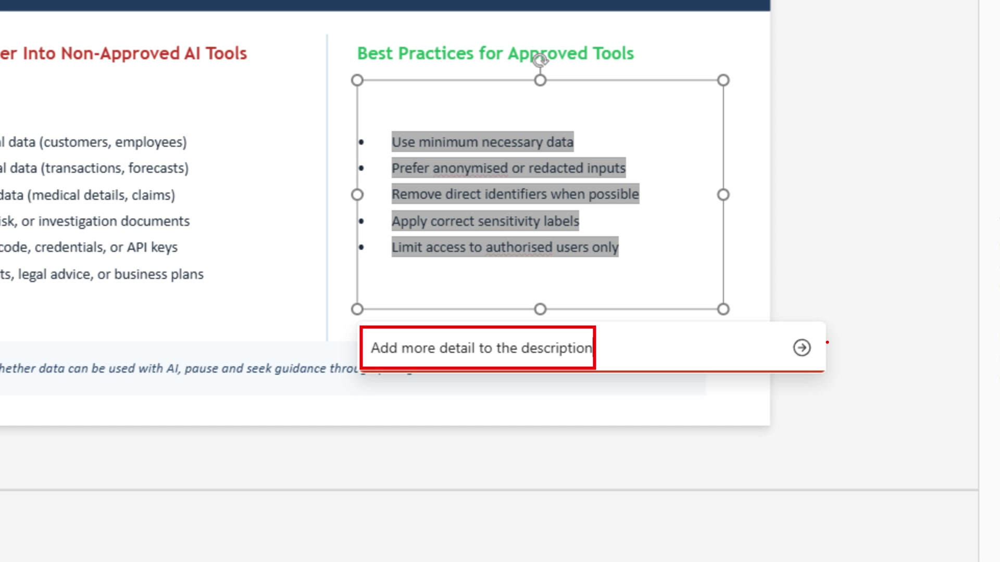
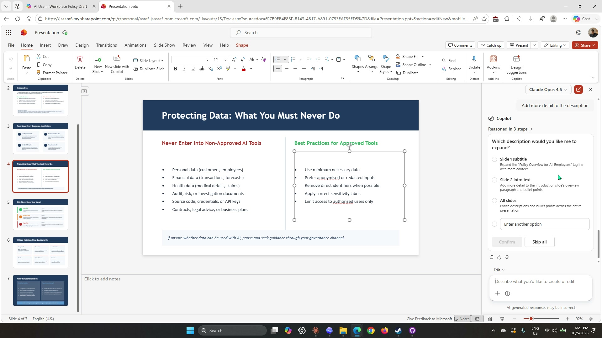

# Lab 06: Present the guideline with PowerPoint

## Scenario

You are still the **HR Officer at Mayfield Bank Berhad**. The AI Usage Guideline has been approved by leadership after the Outlook and Teams discussions in Labs 04 and 05. Now you need to present it to all staff at an upcoming town hall. You will use Copilot in PowerPoint to turn the approved guideline document into a polished staff briefing deck, then refine slides, add speaker notes, and generate an image using natural language prompts.

In this lab, you learn how to:

- Create a blank presentation and open the Copilot panel.
- Generate a full presentation from an existing document.
- Respond to Copilot's clarifying questions during generation.
- Choose a visual style for the deck.
- Refine slides, add speaker notes, and generate images using prompts.

**This lab should take approximately 45 minutes.**

---

## Before you begin

This lab uses the AI Usage Guideline Word document that you polished in Lab 03. Copilot in PowerPoint will read this file from your OneDrive when generating the presentation.

If you completed Lab 03, your document is already in OneDrive and you can skip straight to Part A.

If you skipped Lab 03 or do not have the file in OneDrive, follow these steps before continuing:

1. Download the starter file: [Lab_03_AI_Usage_Guideline.docx](../../Allfiles/Lab_03_AI_Usage_Guideline.docx)
1. Open **OneDrive** in your browser and navigate to your **Documents** folder.
1. Upload the downloaded file to **OneDrive > Documents**.
1. Confirm the file appears in OneDrive before proceeding to Part A.

---

## Part A: Guided Exercise

### Task 1: Create a blank presentation

1. Open your browser and go to [powerpoint.new](https://powerpoint.new), or navigate to PowerPoint via your Microsoft 365 home page. You should see the PowerPoint start page with options to create or open a presentation.

    

1. Select **Create blank presentation**. A new blank slide opens in the editor. You will see one empty slide with placeholder title and subtitle fields, and Copilot suggestions on the right side of the screen.

    

---

### Task 2: Open and configure the Copilot panel

1. The Copilot panel should already be visible on the right after creating the blank presentation. If it is not, select **Copilot** from the **Home** tab in the ribbon.

1. At the top of the Copilot panel, confirm the dropdown reads **Allow editing**. This controls whether Copilot can make changes to the presentation. Leave it set to **Allow editing**.

    

1. Next to the dropdown you will see a model selector showing **Auto**. Select **Auto** to open the model options.

    

1. Select **Claude Opus 4.6** from the list.

    > ***Note:** The model selector may not appear in all Microsoft 365 environments. If you do not see it, proceed to the next step — Copilot will use the default model automatically.*

---

### Task 3: Generate the presentation from the AI Usage Guideline

1. In the Copilot panel prompt field (labelled **Describe what you'd like to create or edit**), type the following:

    ```
    Create a presentation about.
    ```

1. Before submitting, select the **+** icon to the left of the prompt field to attach a reference file.

1. In the file search box that appears, type:

    ```
    AI use
    ```

1. Select the **AI Usage Guideline** document from the results. It will be attached to your prompt as a source.

1. Select the send button to submit the prompt. Copilot will begin processing and you will see its reasoning appear in the chat window as it reads the document.

1. Copilot may ask you clarifying questions before generating the slides. Read each question carefully and answer it. When you have responded, select **Confirm** to let Copilot proceed.

    > ***Note:** Copilot's questions help it understand the audience, tone, and structure you want. Answering them accurately produces a more relevant deck.*

1. Copilot will next ask you to choose a **visual direction** or template style. Review the options presented and select one that suits a professional internal presentation.

1. Select **Clean Corporate Blue and White** (or the closest available option in your environment) and confirm your selection.

1. Copilot will generate the slides. This can take a few minutes. You will see a progress indicator as it works.

    > ***Tip:** This is a good time to check your email or take a short break. Do not close the tab while Copilot is generating.*

1. Once complete, scroll through the slide panel on the left to review the generated deck. Check that the key sections from the guideline — such as permitted uses, prohibited uses, and key rules — are represented.

---

### Task 4: Refine slides, add speaker notes, and generate an image

With the deck generated, you will now use Copilot to refine specific slides, add speaker notes, and create an image for the presentation.

**Add an introduction slide**

1. In the Copilot panel, type the following and press send:

    ```
    Add a slide for introduction.
    ```

1. Once Copilot adds the slide, select **slide 2** in the slide panel on the left to view it and confirm the content is appropriate.

**Add speaker notes**

1. In the Copilot panel, type the following and press send:

    ```
    Add speaker notes to slide number 2.
    ```

1. Select the **Notes** section at the bottom of the screen to view the speaker notes Copilot has added to slide 2. Read through them to confirm they support the slide content.

**Generate an AI image**

1. In the Copilot panel, type the following and press send:

    ```
    Create an image of a robot lawyer holding a book.
    ```

1. Copilot may ask for additional details or confirmation before generating the image. Answer any follow-up questions and confirm.

1. Once the image is generated, check the slide where it has been placed to confirm it looks as expected.

    > ***Note:** AI-generated images are creative interpretations. If the result does not suit the presentation, ask Copilot to try a different description or generate an alternative version.*

**Final review**

1. Run a final prompt to check the overall deck:

    ```
    Review this presentation for consistency. Check that all slides use the same tone and that no key rules from the AI Usage Guideline are missing. Summarise any gaps as a short list.
    ```

1. Use the feedback to make any final manual adjustments before saving.

---

### Task 5: Edit a slide directly with Edit with Copilot

The Copilot panel makes changes across the whole presentation. For targeted edits on a single text block within a slide, PowerPoint offers **Edit with Copilot**, which works the same way as in Word — you select the text, ask Copilot to change it, and only that selection is updated.

1. Navigate to a slide that has a text-heavy section, such as the **Best Practices** or **Permitted Uses** slide. Click once on the text box to select it, then click and drag to highlight the bullet points you want to improve.

    

1. A small floating toolbar will appear above the selection. Select **Edit with Copilot** from the toolbar.

    

1. An inline prompt box appears below the selection. Type the following and press the send button:

    ```
    I want it to be more detailed.
    ```

    

1. Copilot may ask a follow-up question to clarify which part of the slide you want to expand. For example, it might offer options such as the subtitle, the intro text, all slides, or a custom choice. Select the option that matches what you want to improve.

    

1. Once you have selected an option, select **Confirm**. Copilot updates only the selected text — the rest of the slide and all other slides remain untouched.

1. Review the updated text and select **Skip All** if you want to keep the changes as they are, or answer any further questions Copilot asks.

    > ***Note:** Edit with Copilot in PowerPoint is precise — it only touches the text block you selected. If you want to change a section across all slides at once, use the Copilot panel instead.*

---

### Prompt practice

| Weak prompt | Better prompt | Why the better prompt works |
| --- | --- | --- |
| Make a presentation. | Create a staff briefing deck from this document. Use 8 to 10 slides, plain language, and cover what staff must and must not do. | Defines the source, audience, length, and required sections. |
| Fix this slide. | Rewrite this slide in simpler language for non-technical bank staff reading this policy for the first time. | Scopes the edit and names the target audience. |
| Add more slides. | Add a slide covering escalation procedures: who staff should contact when they are unsure whether an AI use is permitted. | Specifies the exact content the new slide needs. |
| Add speaker notes. | Add speaker notes to slide 3. Include a 60-second talking point that explains why this rule exists and gives one real-world example. | Gives a length target and tells Copilot what angle to take. |

---

### Extended practice

- Ask Copilot to generate three alternative title slides and compare how each positions the topic differently.
- Highlight the most text-heavy slide and ask Copilot to convert it into a three-column comparison table.
- Ask Copilot to add speaker notes to every slide at once, keeping each note under 60 words.

---

## Part B: Independent Exercise

**Scenario:** You are a **Corporate Communications Officer at Mayfield Bank Berhad**. The Retail Banking division has launched a new **Instant Account Opening** feature for walk-in customers. Your manager has asked you to prepare an internal briefing deck for branch staff.

Using what you practised in Part A, complete the following with minimal guidance:

1. Open a new blank presentation. Use the Copilot panel to generate a **Branch Staff Briefing** deck from the following notes:

    - Feature: Instant Account Opening for walk-in customers at Mayfield Bank branches
    - How it works: customer presents MyKad, eKYC verification runs, account activated within 5 minutes
    - Account types: Basic Savings Account, Mayfield Everyday Account
    - Staff responsibilities: verify MyKad, confirm eKYC consent, hand over welcome kit
    - Common customer questions: minimum age is 18, initial deposit is RM 50 (Basic) or RM 100 (Everyday), joint accounts not yet available for instant opening
    - Slides required: Feature Overview, How It Works, Staff Checklist, Customer FAQs, Escalation Contacts

1. Use a follow-up prompt to rewrite the **Staff Checklist** slide so each item is an actionable step.

1. Add speaker notes to the **Customer FAQs** slide.

1. Ask Copilot to generate an image suitable for the title slide of a banking product briefing.

> ***Note:** Part B uses the same sequence as Part A: configure the Copilot panel, attach a reference or paste your content, generate, then refine section by section.*

---

## Lab complete

You have used Copilot in PowerPoint to generate a staff briefing presentation from the approved AI Usage Guideline, refined slides with prompts, added speaker notes, and created an AI image. In Lab 07 you will use Copilot in Forms to collect staff feedback on the guideline rollout.
