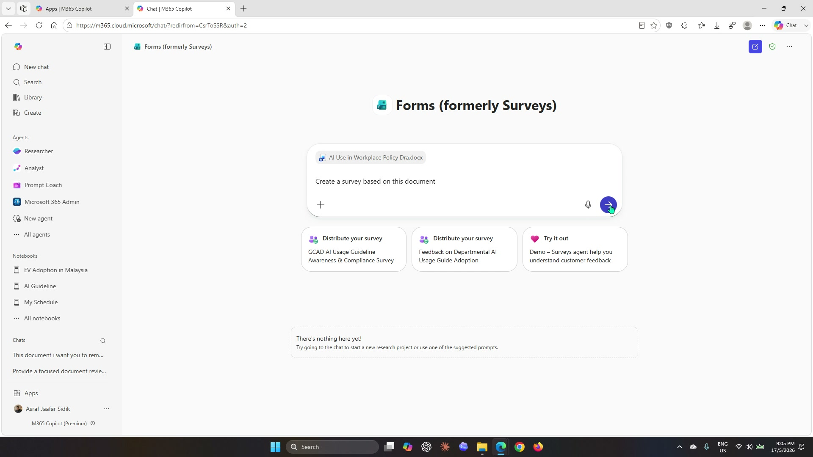
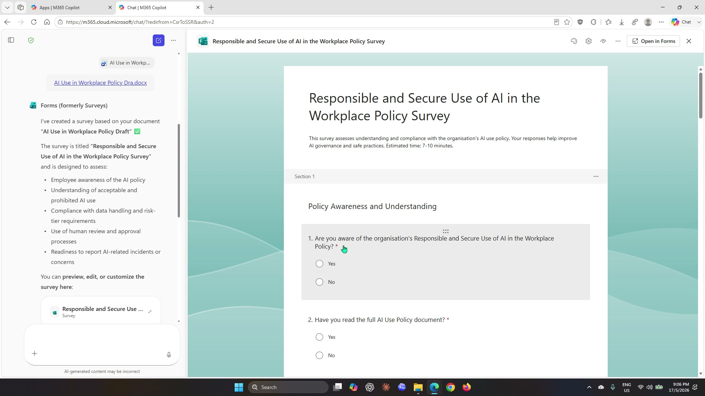
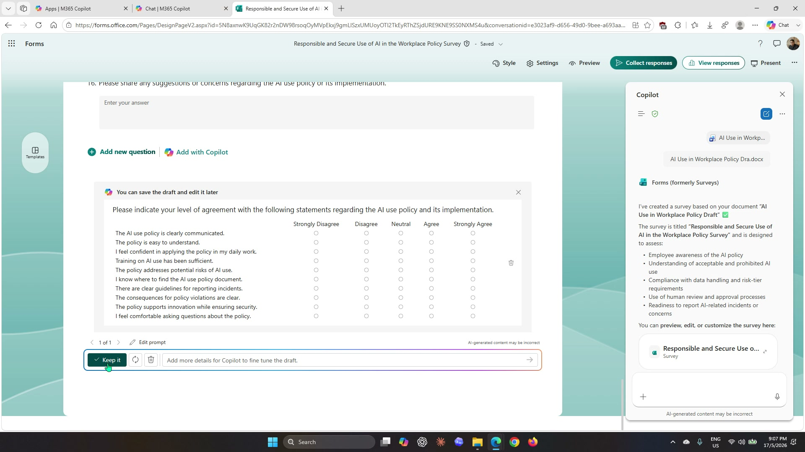
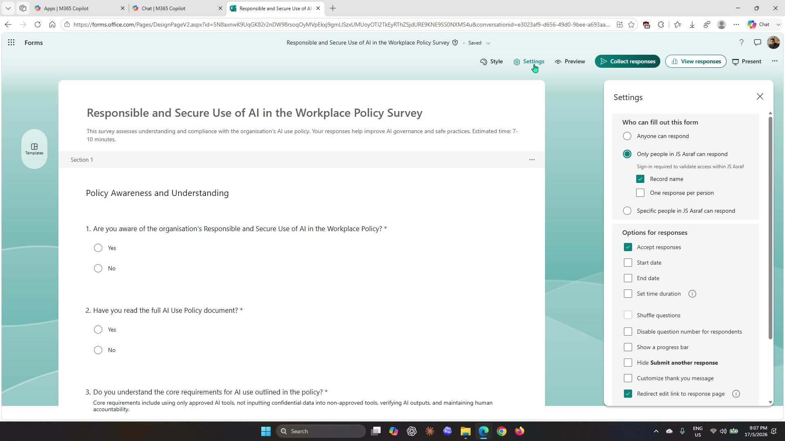
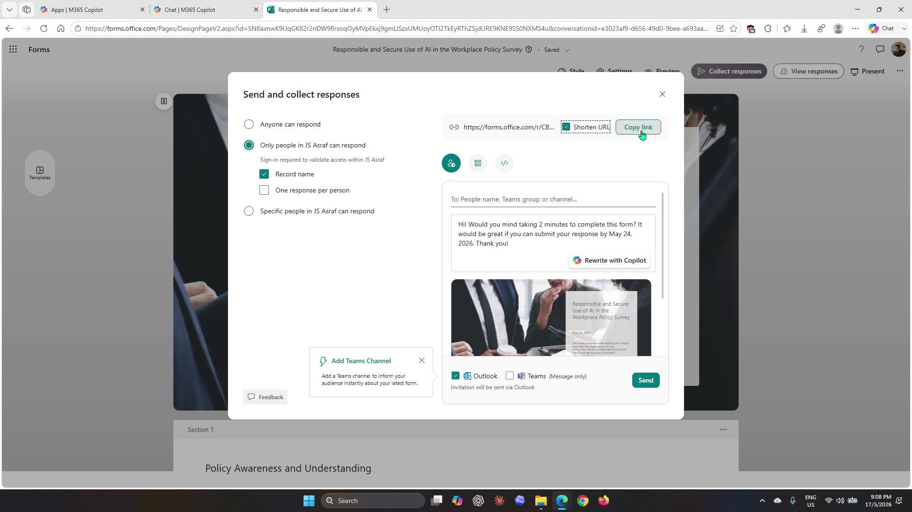
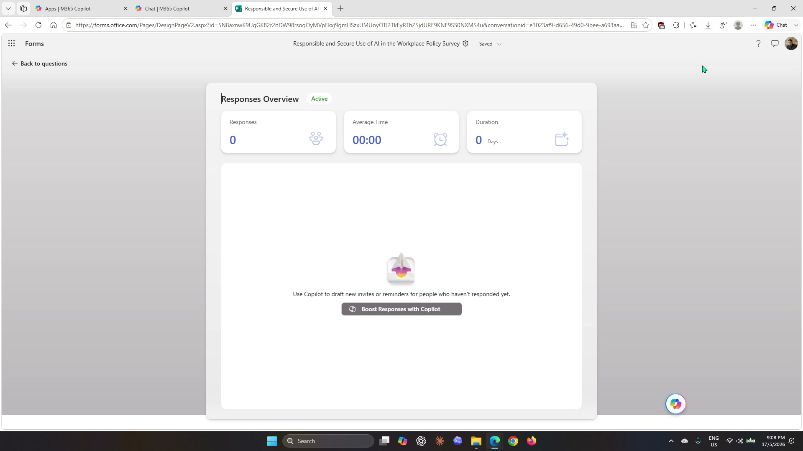

# Lab 07: Collect feedback with Forms

## Scenario

You are still the **HR Officer at Mayfield Bank Berhad**. The AI Usage Guideline has been approved and presented to staff in Lab 06. Now you need to measure how well staff understood the guideline and where confusion remains. You will use the **Forms agent** in Microsoft 365 Copilot to generate a feedback survey directly from the guideline document, refine it with additional Copilot-generated questions, configure the survey settings, and prepare it for distribution.

In this lab, you learn how to:

- Access the Forms agent in Microsoft 365 Copilot Chat.
- Generate a survey from an existing Word document.
- Add a Likert scale question set using Copilot inside Forms.
- Configure who can respond and set response collection options.
- Distribute the survey and locate the responses view.

**This lab should take approximately 30 minutes.**

---

## Part A: Guided Exercise

### Task 1: Open the Forms agent in Microsoft 365 Copilot

1. Open your browser and navigate to [https://m365.cloud.microsoft](https://m365.cloud.microsoft), or open **Microsoft 365 Copilot** from your app launcher.

1. In the left sidebar under **Agents**, select **Forms (formerly Surveys)**. The Forms agent interface will open in the main chat area.

    

    > ***Note:** If you do not see the Forms agent in the sidebar, select **All agents** and search for **Forms**.*

---

### Task 2: Generate a survey from the AI Usage Guideline

1. In the prompt field, select the **+** icon to attach a file. Navigate to your **OneDrive > Documents** folder and select **AI Use in Workplace Policy Dra.docx** — the same document you worked on in Labs 03 and 06.

1. In the prompt field, type the following and press send:

    ```
    Create a survey based on this document.
    ```

    

1. The Forms agent will read the document and generate a survey. Wait for it to complete — you will see a confirmation message with the survey title and a summary of what it covers.

1. The survey will appear in a split-screen preview on the right. Review the questions to confirm the key areas from the guideline are covered.

    

1. Select **Open in Forms** to open the survey in Microsoft Forms for further editing.

---

### Task 3: Add a Likert scale with Copilot

With the survey open in Microsoft Forms, you will use the built-in Copilot feature to add a structured Likert scale section.

1. Scroll to the bottom of the form to find the question editor.

1. Select **Add with Copilot**.

1. In the Copilot prompt box that appears, type the following and select **Generate**:

    ```
    Insert a 10-question Likert Chart.
    ```

    

1. Wait for Copilot to generate the questions. A preview of the Likert scale will appear showing all 10 statements with Strongly Disagree to Strongly Agree response options.

1. Review the generated statements. If they look appropriate, select **Keep it** to add them to the survey.

    > ***Note:** If the generated statements do not fit the AI policy context well, select the regenerate option or edit individual statements manually after keeping them.*

---

### Task 4: Configure survey settings

1. In the Forms toolbar at the top, select **Settings**. The Settings panel will open on the right side.

    

1. Under **Who can fill out this form**, select **Only people in [your organisation] can respond**. This restricts responses to verified employees.

1. Optionally, check **Start date** and **End date** to set a response window. For a real rollout this would typically be 1–2 weeks.

1. Select **Style** in the toolbar to apply a visual theme to the survey.

    > ***Note:** The settings available may vary depending on your Microsoft 365 licence and tenant configuration.*

---

### Task 5: Distribute and view responses

**Distribute the survey**

1. Select **Collect responses** in the toolbar. The **Send and collect responses** dialog will open.

    

1. Check the **Shorten URL** checkbox to generate a shorter link for the survey.

1. Select **Copy link** to copy the survey URL to your clipboard. You can paste this into an email or Teams message to distribute it.

1. To send a direct invitation, type a colleague's name or email address in the **To:** field and select **Send**.

1. To generate a QR code for in-person distribution (such as a town hall or printed handout), switch to the QR code tab and select **Download**.

**View responses**

1. Close the distribution dialog and select **View responses** in the toolbar.

    

1. The **Responses Overview** page shows the number of responses received, average completion time, and duration. Since the survey is new, this will show 0 responses.

1. Once responses are collected, Microsoft Forms saves them automatically to a linked **Microsoft Excel workbook**. In Lab 08 you will open that workbook and use Copilot in Excel to analyse the results.

---

### Prompt practice

| Weak prompt | Better prompt | Why the better prompt works |
| --- | --- | --- |
| Make a survey. | Create a staff feedback survey based on this AI Usage Guideline document. Focus on whether employees understand the permitted uses, the prohibited uses, and the data handling rules. | Names the source document, the audience, and the three specific areas to cover. |
| Add more questions. | Insert a 10-question Likert Chart to measure staff agreement with the policy statements in this survey. | Specifies the question type, the count, and what the questions should measure. |
| Change the settings. | Set this form so only people in my organisation can respond, record their name, and accept responses until 31 May 2026. | Gives Copilot all three settings it needs rather than leaving them open-ended. |

---

### Extended practice

- Ask Copilot to add a branching question: if a respondent says they are not confident about a topic, show them a follow-up asking which specific rule they need more guidance on.
- Ask Copilot to rewrite the Likert statements so they are shorter and easier for non-technical staff to read.
- Use the Style tab to apply a Mayfield Bank colour theme, then preview the form as a respondent would see it.

---

## Part B: Independent Exercise

**Scenario:** You are the **Branch Operations Manager at Mayfield Bank Berhad**. Following the staff briefing on the new Instant Account Opening feature (from Lab 06 Part B), you need to gauge how confident branch staff feel about handling the process with customers.

Using what you practised in Part A, complete the following with minimal guidance:

1. Open the **Forms agent** in Microsoft 365 Copilot. Generate a survey using the following notes as your prompt input (paste them directly or type a summary):

    - Survey purpose: measure staff confidence in the Instant Account Opening process
    - Topics to cover: eKYC verification steps, MyKad handling, account type selection, welcome kit handover, handling customer questions
    - Question types: include a rating scale for overall confidence, multiple choice for which step they find most difficult, and one open text question for additional comments
    - Keep it under 8 questions

1. Once generated, open the survey in Forms and use **Add with Copilot** to insert a 5-statement Likert scale measuring confidence in each key step.

1. Configure the settings so only people in your organisation can respond, and set a 2-week response window.

1. Copy the survey link and review the Responses Overview page.

> ***Note:** Part B follows the same sequence as Part A — Forms agent to generate, Open in Forms to refine, Add with Copilot for extra questions, Settings to configure, Collect responses to distribute.*

---

## Lab complete

You have used the Forms agent in Microsoft 365 Copilot to generate a staff feedback survey from the approved AI Usage Guideline, added a Likert scale using Copilot inside Forms, configured the distribution settings, and located the responses view. In Lab 08 you will use Copilot in Excel to analyse the collected feedback results.
